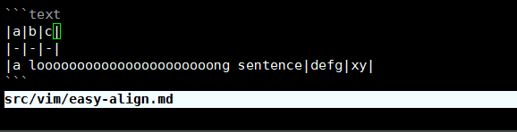

# easy-align

> 官网：[https://github.com/junegunn/vim-easy-align](https://github.com/junegunn/vim-easy-align)

虽然名字里有 **easy**，但我觉得它非常强大，如同 vim 有了 align mode（对齐模式）。

vim 里的各种模式有个特点，出发点都很简单，但可以用统一的方式解决复杂的问题。

当你设置以下快捷键之后：

```vim
nmap ga <Plug>(EasyAlign)
xmap ga <Plug>(EasyAlign)
```

你可以在 visual/normal mode 下按 `ga` 或 `gaip`，再输入对齐方式，即可轻松对齐文本。

比如你有以下文本，选中它，

```text
|a|b|c|
|-|-|-|
|a loooooooooooooooooooooong sentence |defg| xy|
```

然后输入 `ga`，再输入 `*|`，就会很美观地对齐。其等价命令为 `EasyAlign *|`。

```text
| a                                    | b    | c  |
| -                                    | -    | -  |
| a loooooooooooooooooooooong sentence | defg | xy |
```

如果你对默认的对齐方式不满意，可以左、右、中三种对齐方式预览：



1. 在预览 `LiveEasyAlign` 和非预览模式 `EasyAlign` 下切换非常简单：先输入 `ga`，然后输入 `<CTRL-P>`。
2. 输入对齐方式，比如这里输入 `*|` —— 按照所有 `|` 对齐（默认只对第一个分隔符对齐）。
3. 然后输入回车 `Enter` 切换对齐。
4. 最后输入分隔符，比如这里的 `|`，来确认对齐。

从这个例子中，可以看到它最基本的用法：根据对齐符号和对齐方式对齐，而且可以交互式对齐。

然而，作者不满足于简单的对齐需求，现实世界中，你总会遇到各种不规则的文本，你可以利用此插件跳过不需要对齐的行。

对更深入的内容感兴趣，就去其 README 学习吧。

*P.S. 针对这种表格，vim 借由另一个插件从而拥有强大的
[table mode](https://github.com/dhruvasagar/vim-table-mode)。*
