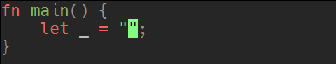

# extras

`luasnip.extras` 模块涵盖了可以轻松编写代码片段的节点。这里只是一个简短的大纲，其用法在 [`Examples/snippets.lua`] 中有更详细的说明。

[`Examples/snippets.lua`]: https://github.com/L3MON4D3/LuaSnip/blob/master/Examples/snippets.lua

* `lambda`：它只执行非常基本的字符串操作。例如，要将 n 次出现的所有 "a" 替换为 "e"，则使用
  `lambda(lambda._1:gsub("a"，"e"), n)`，签名类似于 FunctionNode。如果一个节点有多行，将使用 "\n" 进行拼接。

* `match`：可以根据谓词插入文本。节点的完整签名是 `match(argnodes, condition, then, else)`，其中
  * `argnodes` 可以在 FunctionNode 中指定
  * `condition` 可以是一个
    * string：解释为 Lua 模式。在 `\n` 拼接的文本中匹配第一个 argnode (`args[1]:match(condition)`)
    * function：形式为 `fn(args, snip) -> bool`，参数与 FunctionNode 相同，任何非 nil 或 false 的值都被解释为一个 match
    * lambda：`l._n` 是第 n 个 argnode 文本。如果必须在字符串匹配之前执行字符串操作，则这非常有用。
  * 如果条件匹配，则插入 `then`，如果条件不匹配，则插入 `else`。它们都可以是文本、lambda 或函数（具有上面指定的相同参数）。如果不传
    `then`，则 `then` 的值取决于 `condition`：
    * pattern：只返回 `match` 的返回值，例如如果有捕获组的话，则返回第一个捕获组。
    * function：函数的返回值，如果它是字符串或表；如果没有 `then`，则函数不能返回除字符串以外的表。
    * lambda：仅由 lambda 返回的第一个值。

    示例：
    * `match(n, "^ABC$", "A")` 如果第 n 个可跳转节点与 `ABC` 完全匹配，则插入 `A`，否则不插入 `A`。
    * `match(n, lambda._1:match(lambda._1:reverse()), "PALINDROME")` 如果第 n 个可跳转节点是回文 (palindrome)，则插入回文。
    * 以下代码将插入第一个 IntertNode，如果第二个 IntertNode 与第一个完全匹配，则所有出现的 `a` 都将替换为 `e`。
      ```lua
      s("extras3", {
        i(1), t { "", "" },
        i(2), t { "", "" },
        m({ 1, 2 }, l._1:match("^" .. l._2 .. "$"), l._1:gsub("a", "e"))
      }),
      ```

* `rep`：重复带有传递的索引的节点。`rep(1)` 表示重复第一个插入的内容。
* `partial`：直接插入函数的输出。对于 `partial(os.date, "%Y")` 这种来说很有用。
* `nonempty`：如果给定索引处的插入不包含任何文本，则插入文本。例如 `nonempty(n, "not empty!", "empty!")` 在 n 处为空时插入
  `empty`，非空时插入 `not empty!`。
* `dynamic_lambda`：操作与 `lambda` 几乎完全相同，只是还可以跳转，因此其内容很容易被覆盖。例如 
  `dynamic_lambda(2, lambda._1..lambda._1, 1)` 先把附加到其自身的节点 1 的内容包括进去，但第二次跳转将指向它，从而很容易覆盖生成的文本。只有当 argnode 更新文本时，才会更改文本。

```lua
ls.add_snippets("all", {
  s("extras1", {
    i(1), t { "", "" }, m(1, "^ABC$", "A")
  }),
  s("extras2", {
    i(1, "INPUT"), t { "", "" }, m(1, l._1:match(l._1:reverse()), "PALINDROME")
  }),
  s("extras3", {
    i(1), t { "", "" }, i(2), t { "", "" },
    m({ 1, 2 }, l._1:match("^" .. l._2 .. "$"), l._1:gsub("a", "e"))
  }),
  s("extras4", { i(1), t { "", "" }, extras.rep(1) }),
  s("extras5", { extras.partial(os.date, "%Y") }),
  s("extras6", { i(1, ""), t { "", "" }, extras.nonempty(1, "not empty!", "empty!") }),
  s("extras7", { i(1), t { "", "" }, extras.dynamic_lambda(2, l._1 .. l._1, 1) }),
})
```

extras1：

extras2：

extras3：

extras4：

extras5：

extras6：

extras7：

# FMT

可以使用 `require("luasnip.extras.fmt").fmt` 来创建更具可读性的代码片段。

简单的例子：

```lua
ls.add_snippets("all", {
  -- important! fmt does not return a snippet, it returns a table of nodes.
  s("example1", fmt("just an {iNode1}", {
    iNode1 = i(1, "example")
  })),
  s("example2", fmt([[
  if {} then
    {}
  end
  ]], {
    -- i(1) is at nodes[1], i(2) at nodes[2].
    i(1, "not now"), i(2, "when")
  })),
  s("example3", fmt([[
  if <> then
    <>
  end
  ]], {
    -- i(1) is at nodes[1], i(2) at nodes[2].
    i(1, "not now"), i(2, "when")
  }, {
    delimiters = "<>"
  })),
})
```


`fmt(format:string, nodes:table of nodes, opts:table|nil) -> table of nodes`：

| 参数     | 类型     | 含义                                                                                                                                |
|----------|----------|-------------------------------------------------------------------------------------------------------------------------------------|
| `format` | 字符串   | 使用 `{<somekey>}` 插值，其内容被替换成 `content[<somekey>]`[^format-key]，要转义 `{` 则使用 `{{`。不提供 key 则按数字顺序[^format] |
| `nodes`  | 节点表   | 比如 `{1, 2}` 表示使用前 2 个节点                                                                                                   |
| `opts`   | 可选参数 |                                                                                                                                     |
|          |          | `delimiters`：两字符的字符串，改变 `{}` 符号，比如使用 `<>`                                                                         |
|          |          | `strict`：是否警告未使用的节点，默认为 true                                                                                         |
|          |          | `trim_empty`：是否删除第一行和最后一行的空字符串 `%s`，默认为 true；对多行字符串 `[[]]` 很有用（更美观）                            |
|          |          | `dedent`：是否删除所有行的缩进，默认为 true；对多行字符串 `[[]]` 很有用（更美观）                                                   |


[^format-key]: 如果重复 key，第二次之后插入的内容是第一次插入内容的复制。

[^format]: `"{} ? {} : {}"` 变成 `"{1} ? {2} : {3}"`，`"{} ? {3} : {}"` 变成 `"{1} ? {3} : {4}"`。

`require "luasnip.extras.fmt".fmta` 与 `fmt` 的区别只是前者使用尖括号 `<>` 作为默认分隔符。

# On The Fly

你可以创建不会在所有文件中使用而只在单个会话中使用的代码段。

这就像获取寄存器中的内容并将其转换为片段：使用以 `$` 为前缀的单词作为输入或副本（这取决于同一单词是否多次出现）。

你可以通过重复 `$` （即 `$$` ）来转义 `$`。

你的配置中还添加类似以下内容：

```vim
vnoremap <c-f>e "ec<cmd>lua require('luasnip.extras.otf').on_the_fly()<cr>
inoremap <c-f>e <cmd>lua require('luasnip.extras.otf').on_the_fly("e")<cr>
```

注意，你可以使用自己的映射来代替，也可以选择另一个寄存器。你甚至可以多次使用它，它就像是宏一样：

```vim
" For register a
vnoremap <c-f>a  "ac<cmd>lua require('luasnip.extras.otf').on_the_fly()<cr>
inoremap <c-f>a  <cmd>lua require('luasnip.extras.otf').on_the_fly("a")<cr>


" For register b
vnoremap <c-f>a  "bc<cmd>:lua require('luasnip.extras.otf').on_the_fly()<cr
inoremap <c-f>b  <cmd>lua require('luasnip.extras.otf').on_the_fly("b")<cr>
```


# select_choice

可以利用 `vim.ui.select` 直接选择选项，而不需要在选项之间循环。

只需要调用 `require("luasnip.extras.select_choice")`，最好是通过某个键绑定，例如

```vim
inoremap <c-s> <cmd>lua require("luasnip.extras.select_choice")()<cr>
```

这会对 `vim.ui.select` 的 `opts.kind` 提示设置为 `luasnip`。


# 文件类型函数

LuaSnip 包含一些可传递给 `ft_unc` 或 `load_ft_func` 的实用函数。

* `from_filetype`：`ft_func` 的默认值，只返回缓冲区的文件类型。
* `from_cursor_pos`：使用 treesitter 来确定光标处的文件类型。这样，就可以在注入区域中展开代码片断，只要 treesitter 
  解析器支持它们。如果与 `lazy_load` 结合使用，则必须特别注意，在给定缓冲区中可以展开的所有文件类型也由 `load_ft_func`
  返回（否则可能无法加载它们的片段）。这可以很容易地通过 `extend_load_ft` 来实现。
* `extend_load_ft`: `fn(extend_ft:map) -> fn`
  上述问题的一个简单解决方案是在 `lazy_load` 时加载比目标缓冲区更多的文件类型。这可以方便地通过的 `extend_load_ft` 
  来完成：使用一个表调用它，其中键是文件类型，值是额外加载的文件类型，并且返回一个可以传递给 `load_ft_func`
  的函数，并且正确地处理扩展文件类型。
  ```lua
  ls.config.setup {
    load_ft_func =
    -- Also load both lua and json when a markdown-file is opened,
    -- javascript for html.
    -- Other filetypes just load themselves.
    require "luasnip.extras.filetype_functions".extend_load_ft {
      markdown = { "lua", "json" },
      html = { "javascript" }
    }
  }
  ```

# LSP 片段

LuaSnip 可以使用 `ls.parser.parse_snippet(context, snippet_string)` 来解析 LSP 样式的片段：

```lua
ls.parser.parse_snippet({trig = "lsp"}, "$1 is ${2|hard,easy,challenging|}")
```



嵌套占位符 `${1：This is${2：NESTED}` 将转换为 ChoiceNode，并带有：
- 给定的代码片段 `This is ${1:nested}"`和
- 一个空的插入节点

# 变量

支持所有 [`TM_something`] 变量，和两个新变量： `SELECT_RAW` 和 `SELECT_DEDENT`。

之所以引入这些代码，是因为 `TM_SELECTED_TEXT` 被设计为与 VScode 
行为兼容，当片段可以在除选择开始点之外的位置展开时（或对所选文本执行变换时），这可能是违反直觉的。

所有变量都可以在 LSP 解析的代码段之外使用，因为它们的值存储在片段的 `snip.env` 表中：

```lua
s("selected_text", f(function(args, snip)
  local res, env = {}, snip.env
  table.insert(res, "Selected Text (current line is " .. env.TM_LINE_NUMBER .. "):")
  for _, ele in ipairs(env.SELECT_RAW) do table.insert(res, ele) end
  return res
end, {}))
```

要使用任何 `*SELECT*` 变量，必须通过 `require("luasnip").config.setup({store_selection_keys="<Tab>"})` 来设置
`store_selection_keys`，此时，在 visual 模式下按 `<Tab>` 将填充下一个片断的 `*SELECT*` 变量，然后清除它们。


[`TM_something`]: https://microsoft.github.io/language-server-protocol/specifications/lsp/3.17/specification/#snippet_syntax

# 环境变量命名空间

你也可以使用 `ls.env_namespace(name, opts)` 添加你自己的变量，其中：
* `name`:字符串,命名空间的名称，不能包含字符 `\_`
* `opts`：是包含以下内容的表（在下述情况下，`EnvVal` 都与 `string|list[string]` 一样：
  * `vars`：`(fn(name:string)->EnvVal) | map[string, EnvVal]`
    * 是一个函数，它接收字符串并返回该名称的变量的值
    * 或者是从变量名到值的表；此时，如果值是一个函数，它将在每个片段展开时惰性执行一次
  * `init`：`fn(pos: pair[int])->map[string, EnvVal]`
    获取从 0 开始的光标位置，并返回一个变量表，该表将在展开时设置为片段的环境，用于必须在该时刻计算的变量或彼此依赖的变量。
  * `eager`：`list[string]`，将从 `vars` 获取并急于追加的变量的名称，比如 `init` 中的变量
  * `multiline_vars`：`(fn(name:string)->bool)|map[sting, bool]|bool|string[]`
     如果某些变量是表或字符串，则可以是获取变量名称的函数，如果变量是键，则返回 true 
     作为表的变量列表，或者是完整命名空间的布尔值，默认为 false。这个字段是可选的，但你需要提供
     `init` 或 `vars`，并且 `eager` 不能没有 `vars`。此外，你不能覆盖默认变量的名称空间。

举一个简单的例子，让我们更清楚地了解：

```lua
local function random_lang()
  return ({ "LUA", "VIML", "VIML9" })[math.floor(math.random() / 2 + 1.5)]
end

ls.env_namespace("MY", { vars = { NAME = "LuaSnip", LANG = random_lang } })

-- then you can use  $MY_NAME and $MY_LANG in your snippets

ls.env_namespace("SYS", { vars = os.getenv, eager = { "HOME" } })

-- then you can use  $SYS_HOME which was eagerly initialized but also $SYS_USER (or any other system environment var) in your snippets

ls.env_namespace("POS", { init = function(pos) return { VAL = vim.inspect(pos) } end })

-- then you can use  $POS_VAL in your snippets

s("custom_env", d(1, function(args, parent)
  local env = parent.snippet.env
  return sn(nil, t {
    "NAME: " .. env.MY_NAME,
    "LANG: " .. env.MY_LANG,
    "HOME: " .. env.SYS_HOME,
    "USER: " .. env.SYS_USER,
    "VAL: " .. env.POS_VAL
  })
end, {}))
```


# Loaders

Luasnip is capable of loading snippets from different formats, including both
the well-established vscode- and snipmate-format, as well as plain lua-files for
snippets written in lua

Luasnip能够加载不同格式的代码片段，包括成熟的vscode和Snipmate格式，以及用Lua编写的代码片段的纯Lua文件

All loaders share a similar interface:

所有加载器都共享一个类似的接口：

```lua
require("luasnip.loaders.from_{vscode,snipmate,lua}").{lazy_,}load(opts:table"nil)
```

where `opts` can contain the following keys:

其中`opts`可以包含以下密钥：

* `paths`: List of paths to load. Can be a table, or a single
  comma-separated string.
  The paths may begin with `~/` or `./` to indicate that the path is
  relative to your `$HOME` or to the directory where your `$MYVIMRC` resides
  (useful to add your snippets).  
  If not set, `runtimepath` is searched for
  directories that contain snippets. This procedure differs slightly for
  each loader:
  * `lua`: the snippet-library has to be in a directory named
    `"luasnippets"`.
  * `snipmate`: similar to lua, but the directory has to be `"snippets"`.
  * `vscode`: any directory in `runtimepath` that contains a
    `package.json` contributing snippets.
* `exclude`: List of languages to exclude, empty by default.
* `include`: List of languages to include, includes everything by default.
* `{override,default}_priority`: These keys are passed straight to the
  [`add_snippets`](#api-reference)-calls and can therefore change the priority
  of snippets loaded from some colletion (or, in combination with
  `{in,ex}clude`, only some of its snippets).

While `load` will immediately load the snippets, `lazy_load` will defer loading until
the snippets are actually needed (whenever a new buffer is created, or the
filetype is changed luasnip actually loads `lazy_load`ed snippets for the
filetypes associated with this buffer. This association can be changed by
customizing `load_ft_func` in `setup`: the option takes a function that, passed
a `bufnr`, returns the filetypes that should be loaded (`fn(bufnr) -> filetypes (string[])`)).

\`paths`：要加载的路径列表。可以是表，也可以是单个逗号分隔的字符串。路径可以以`~/`或`./`开头，表示该路径相对于你的`$HOME`或你的`$MYVIMRC`所在的目录(对于添加你的代码片段非常有用)。如果未设置，则在`runtimepath`中搜索包含片段的目录。对于每个加载器，此过程略有不同：`lua`：代码片断-库必须位于名为`"luasnipets"`的目录中。`Snipmate`：类似于Lua，但目录必须是`"代码片断"`。`vscalde`：`runtime路径`中包含`Package.json`的任何目录。`exclude`：要排除的语言列表，默认情况下为空。`clude`：要包含的语言列表，默认情况下包括所有内容。`{override，default}_priority`：这些键直接传递给`add_snippets`-调用，因此可以更改加载的代码片断的优先级(或与`{in，ex}clude`结合使用，只有一些片段)。虽然`load`会立即加载片段，但`lazy_load`会推迟加载到实际需要的片段(无论何时创建新的缓冲区，或者更改文件类型，luasnip实际上都会加载与该缓冲区相关联的文件类型的`lazy_load`片段。可以通过在`setup`中自定义`load_ft_unc`来改变这种关联：该选项接受一个函数，该函数传递一个`bufnr`，返回应该加载的文件类型(`fn(Bufnr)->filetypes(字符串[])`))。

All of the loaders support reloading, so simply editing any file contributing
snippets will reload its snippets (only in the session the file was edited in,
we use `BufWritePost` for reloading, not some lower-level mechanism).

所有的加载器都支持重载，所以简单地编辑任何文件贡献的片段都会重新加载它的片段(只有在编辑文件的会话中，我们使用`BufWritePost`重载，而不是一些较低级别的机制)。

For easy editing of these files, Luasnip provides a [`vim.ui.select`-based
dialog](#edit_snippets) where first the filetype, and then the file can be
selected.

为了方便地编辑这些文件，Luasnip提供了一个基于`vim.ui.selt`的对话框，在该对话框中，首先是文件类型，然后可以选择文件。

# Troubleshooting

# 故障排除

* Luasnip uses `all` as the global filetype. As most snippet collections don't
  explicitly target luasnip, they may not provide global snippets for this
  filetype, but another, like `_` (`honza/vim-snippets`).
  In these cases, it's necessary to extend luasnip's global filetype with the
  collection's global filetype:
  
  Luasnip使用`all`作为全局文件类型。由于大多数代码段集合并不明确地以luasnip为目标，因此它们可能不会为该文件类型提供全局代码段，而是提供另一个文件类型，如`_`(`honza/vim-snippets`)。在这些情况下，有必要使用集合的全局文件类型扩展luasnip的全局文件类型：
  
  ```lua
  ls.filetype_extend("all", { "_" })
  ```
  
  In general, if some snippets don't show up when loading a collection, a good
  first step is checking the filetype luasnip is actually looking into (print
  them for the current buffer via `:lua print(vim.inspect(require("luasnip").get_snippet_filetypes()))`), against the
  one the missing snippet is provided for (in the collection).  
  If there is indeed a mismatch, `filetype_extend` can be used to also search
  the collection's filetype:
  
  通常，如果在加载集合时某些代码片段没有出现，那么第一步就是检查luasnip实际正在查找的文件类型(通过`：lua print(vim.inspect(require("luasnip").get_snippet_filetypes()))`)，将它们打印到当前缓冲区)，而不是(在集合中)为缺失的代码片段提供的文件类型。如果确实存在不匹配，也可以使用`filetype_extend`来搜索集合的文件类型：
  
  ```lua
  ls.filetype_extend("<luasnip-filetype>", { "<collection-filetype>" })
  ```

* As we only load `lazy_load`ed snippet on some events, `lazy_load` will
  probably not play nice when a non-default `ft_func` is used: if it depends on
  e.g. the cursor-position, only the filetypes for the cursor-position when the
  `lazy_load`-events are triggered will be loaded. Check
  [filetype_function's `extend_load_ft`](#filetype_functions) for a solution.
  
  由于我们只在某些事件上加载`lazy_load`片段，当使用非默认的`ft_unc`时，`lazy_load`可能不会很好地发挥作用：如果它依赖于例如游标位置，那么当`lazy_load`-事件被触发时，只会加载游标位置的文件类型。查看FILETYPE_Function的`EXTEND_LOAD_ft`以了解解决方案。

# VSCODE

# VSCODE

As a reference on the structure of these snippet-libraries, see
[`friendly-snippets`](https://github.com/rafamadriz/friendly-snippets).

有关这些代码片断库结构的参考，请参阅`Friendly-Snippets`。

We support a small extension: snippets can contain luasnip-specific options in
the `luasnip`-table:

我们支持一个小扩展：代码片段可以在`luasnip`-table中包含特定于luasnip的选项：

```json
"example1": {
	"prefix": "options",
	"body": [
		"whoa! :O"
	],
	"luasnip": {
		"priority": 2000,
		"autotrigger": true
	}
}
```

**Example**:

示例：

`~/.config/nvim/my_snippets/package.json`:

\`~/.config/nvim/my_Snippits/Package.json`：

```json
{
	"name": "example-snippets",
	"contributes": {
		"snippets": [
			{
				"language": [
					"all"
				],
				"path": "./snippets/all.json"
			},
			{
				"language": [
					"lua"
				],
				"path": "./lua.json"
			}
		]
	}
}
```

`~/.config/nvim/my_snippets/snippets/all.json`:

\`~/.config/nvim/my_snippets/snippets/all.json`：

```json
{
	"snip1": {
		"prefix": "all1",
		"body": [
			"expands? jumps? $1 $2 !"
		]
	},
	"snip2": {
		"prefix": "all2",
		"body": [
			"multi $1",
			"line $2",
			"snippet$0"
		]
	},
}
```

`~/.config/nvim/my_snippets/lua.json`:

\`~/.config/nvim/my_Snippits/lua.json`：

```json
{
	"snip1": {
		"prefix": "lua",
		"body": [
			"lualualua"
		]
	}
}
```

This collection can be loaded with any of

此集合可以加载以下任一项

```lua
-- don't pass any arguments, luasnip will find the collection because it is
-- (probably) in rtp.
require("luasnip.loaders.from_vscode").lazy_load()
-- specify the full path...
require("luasnip.loaders.from_vscode").lazy_load({paths = "~/.config/nvim/my_snippets"})
-- or relative to the directory of $MYVIMRC
require("luasnip.loaders.from_vscode").load({paths = "./my_snippets"})
```

# SNIPMATE

# SNIPMATE

Luasnip does not support the full snipmate format: Only `./{ft}.snippets` and
`./{ft}/*.snippets` will be loaded. See
[honza/vim-snippets](https://github.com/honza/vim-snippets) for lots of
examples.

Luasnip不支持完整的Snipmate格式：只会加载`./{ft}.snippets`和`./{ft}/*.snippets`。有关许多示例，请参见honza/vim-Snippits。

Like vscode, the snipmate-format is also extended to make use of some of
luasnips more advanced capabilities:

与vscode一样，Snipmate格式也进行了扩展，以利用一些更高级的luasnip功能：

```snippets
priority 2000
autosnippet options
	whoa :O
```

**Example**:

示例：

`~/.config/nvim/snippets/c.snippets`:

\`~/.config/nvim/Snippits/c.Snippets`：

```snippets
# this is a comment
snippet c c-snippet
	c!
```

`~/.config/nvim/snippets/cpp.snippets`:

\`~/.config/nvim/Snippits/cpp.snippets`：

```snippets
extends c

snippet cpp cpp-snippet
	cpp!
```

This can, again, be loaded with any of 

同样，它可以加载以下任何内容

```lua
require("luasnip.loaders.from_snipmate").load()
-- specify the full path...
require("luasnip.loaders.from_snipmate").lazy_load({paths = "~/.config/nvim/snippets"})
-- or relative to the directory of $MYVIMRC
require("luasnip.loaders.from_snipmate").lazy_load({paths = "./snippets"})
```

Stuff to watch out for:

需要注意的事项：

* Using both `extends <ft2>` in `<ft1>.snippets` and
  `ls.filetype_extend("<ft1>", {"<ft2>"})` leads to duplicate snippets.
* `${VISUAL}` will be replaced by `$TM_SELECTED_TEXT` to make the snippets
  compatible with luasnip
* We do not implement eval using \` (backtick). This may be implemented in the
  future.

# LUA

在`和`ls.filetype_EXTEND("<FT1>"，{"<ft2>"})`中同时使用`EXTENDS<ft2>`会导致重复的代码片断。`${VISUAL}`将被替换为`$TM_SELECTED_TEXT`，以使代码片段与luasnip兼容。我们不使用`(反引号)实现eval。这可能在未来实施。LUA

Instead of adding all snippets via `add_snippets`, it's possible to store them
in separate files and load all of those.
The file-structure here is exactly the supported snipmate-structure, e.g.
`<ft>.lua` or `<ft>/*.lua` to add snippets for the filetype `<ft>`.  
The files need to return two lists of snippets (either may be `nil`). The
snippets in the first are regular snippets for `<ft>`, the ones in the
second are autosnippets (make sure they are enabled in `setup` or `set_config`
if this table is used).

不是通过`addsnppets`添加所有代码片段，而是可以将它们存储在单独的文件中并加载所有这些文件。这里的文件结构正是支持的代码段结构，例如`<ft>.lua`或`<ft>/*.lua`，用于为文件类型`<ft>`添加代码片断。这些文件需要返回两个代码片断列表(两个列表中的任何一个都可以是`nil`)。第一个片段是`<ft>`的常规片段，第二个片段是自动片段(如果使用此表，请确保在`setup`或`set_config`中启用它们)。

As defining all of the snippet-constructors (`s`, `c`, `t`, ...) in every file
is rather cumbersome, luasnip will bring some globals into scope for executing
these files.
By default, the names from [`luasnip.config.snip_env`](https://github.com/L3MON4D3/LuaSnip/blob/69cb81cf7490666890545fef905d31a414edc15b/lua/luasnip/config.lua#L82-L104) will be used, but it's
possible to customize them by setting `snip_env` in `setup`.

定义所有代码段构造函数(`s`、`c`、`t`，...)在每个文件都相当繁琐的情况下，luasnip会将一些全局变量带入执行这些文件的范围。默认情况下，将使用`luasnip.config.nip_env`中的名称，但也可以通过在`setup`中设置`snip_env`来自定义名称。

**Example**:

示例：

`~/snippets/all.lua`:

\`~/SNIPPETS/all.lua`：

```lua
return {
	parse("trig", "loaded!!")
}
```

`~/snippets/c.lua`:

\`~/SNIPPETS/c.lua`：

```lua
return {
	parse("ctrig", "also loaded!!")
}, {
	parse("autotrig", "autotriggered, if enabled")
}
```

Load via 

加载方式

```lua
require("luasnip.loaders.from_lua").load({paths = "~/snippets"})
```

# EDIT_SNIPPETS

# 编辑代码段(_S)

To easily edit snippets for the current session, the files loaded by any loader
can be quickly edited via
`require("luasnip.loaders").edit_snippet_files(opts:table"nil)`  
When called, it will open a `vim.ui.select`-dialog to select first a filetype,
and then (if there are multiple) the associated file to edit.

为了方便地编辑当前会话的代码片断，任何加载器加载的文件都可以通过`require("luasnip.loaders").edit_snippet_files(opts:table"nil)`在被调用时快速编辑，它将打开一个`vim.ui.selt`-对话框，首先选择一个文件类型，然后(如果有多个)要编辑的关联文件。

`opts` currently only contains one setting:

\`opts`目前仅包含一项设置：

* `format`: `fn(file:string, source_name:string) -> string"nil`  
  `file` is simply the path to the file, `source_name` is one of `"lua"`,
  `"snipmate"` or `"vscode"`.  
  If a string is returned, it is used as the title of the item, `nil` on the
  other hand will filter out this item.  
  The default simply replaces some long strings (packer-path and config-path)
  in `file` with shorter, symbolic names (`"$PLUGINS"`, `"$CONFIG"`), but
  this can be extended to
  * filter files from some specific source/path
  * more aggressively shorten paths using symbolic names, e.g.
    `"$FRIENDLY_SNIPPETS"`
* `edit`: `fn(file:string)` This function is supposed to open the file for
  editing. The default is a simple `vim.cmd("edit " .. file)` (replace the
  current buffer), but one could open the file in a split, a tab, or a floating
  window, for example.

One comfortable way to call this function is registering it as a command:

\`格式`：`fn(文件：字符串，源名称：字符串)->字符串"nil``文件`只是文件的路径，`源名称`是`"Lua"`、`"Snipmate"`或`"vscode"`中的一个。如果返回一个字符串，则将其用作项目的标题，反之，`nil`将过滤掉该项目。默认设置只是将`file`中的一些长字符串(打包路径和配置路径)替换为较短的符号名称(`"$plugins"`，`"$CONFIG"`)，但可以将其扩展为过滤某些特定来源/路径中的文件，使用符号名称更积极地缩短路径，例如`"$Friendly_Snippits"``edit`：`fn(FILE：STRING)`这个函数应该打开文件进行编辑。缺省值是一个简单的`vim.cmd("编辑"..文件)`(替换当前缓冲区)，但用户可以在拆分、制表符或浮动窗口中打开文件。调用此函数的一种舒适方法是将其注册为命令：

```vim
command! LuaSnipEdit :lua require("luasnip.loaders").edit_snippet_files()
```

# SNIPPETPROXY

# SNIPPETPROXY

`SnippetProxy` is used internally to alleviate the upfront-cost of
loading snippets from e.g. a snipmate-library or a vscode-package. This is
achieved by only parsing the snippet on expansion, not immediately after reading
it from some file.
`SnippetProxy` may also be used from lua directly, to get the same benefits:

\`SnippetProxy`在内部使用，以减少从Snipmate库或vscode包加载代码片段的前期成本。这是通过在展开时才解析代码段来实现的，而不是在从某个文件中读取代码段之后立即进行解析。`SnippetProxy`也可以直接从Lua使用，获得相同的好处：

This will parse the snippet on startup...

这将在启动时解析代码段...

```lua
ls.parser.parse_snippet("trig", "a snippet $1!")
```

... and this will parse the snippet upon expansion.

..。这将在展开时解析代码片段。

```lua
local sp = require("luasnip.nodes.snippetProxy")
sp("trig", "a snippet $1")
```

# EXT\_OPTS

# 外部选项(_O)

`ext_opts` can be used to set the `opts` (see `nvim_buf_set_extmark`) of the
extmarks used for marking node-positions, either globally, per-snippet or
per-node.
This means that they allow highlighting the text inside of nodes, or adding
virtual text to the line the node begins on.

\`ext_opts`可以设置用于标记节点位置的extmark的`opts`(参见`nvim_buf_set_extmark`)，可以是全局的，也可以是按片段的，也可以是按节点的。这意味着它们允许突出显示节点内的文本，或将虚拟文本添加到节点开始的行上。

This is an example for the `node_ext_opts` used to set `ext_opts` of single nodes:

下面是设置单节点`ext_opts`的`node_ext_opts`示例：

```lua
local ext_opts = {
	-- these ext_opts are applied when the node is active (e.g. it has been
	-- jumped into, and not out yet).
	active = 
	-- this is the table actually passed to `nvim_buf_set_extmark`.
	{
		-- highlight the text inside the node red.
		hl_group = "GruvboxRed"
	},
	-- these ext_opts are applied when the node is not active, but
	-- the snippet still is.
	passive = {
		-- add virtual text on the line of the node, behind all text.
		virt_text = {{"virtual text!!", "GruvboxBlue"}}
	},
	-- and these are applied when both the node and the snippet are inactive.
	snippet_passive = {}
}

...

s("trig", {
	i(1, "text1", {
		node_ext_opts = ext_opts
	}),
	i(2, "text2", {
		node_ext_opts = ext_opts
	})
})
```

In the above example the text inside the insertNodes is higlighted in red while
inside them, and the virtual text "virtual text!!" is visible as long as the
snippet is active.

在上面的例子中，插入节点内的文本以红色高亮显示，而虚拟文本"虚拟文本！！"只要代码段处于活动状态，该代码段就可见。

It's important to note that `snippet_passive` applies to the states
`snippet_passive`, `passive`, and `active`, `passive` to `passive` and `active`,
and `active` only to `active`.

需要特别注意的是，`Snipket_PASSIVEVE`适用于`SNIPPET_PASSIVEVE`、`PASSIVEVE`和`Active`状态，`PASSIVVE`适用于`PASSIVEVE`和`Active`状态，`Active`仅适用于`Active`状态。

To disable a key from a "lower" state, it has to be explicitly set to its
default, e.g. to disable highlighting inherited from `passive` when the node is
`active`, `hl_group` could be set to `None` in `active`.

若要禁用处于较低状态的key，则必须将其显式设置为默认值，例如当节点为`active`时，若要禁用从`被动`继承的高亮显示，则可以在`active`中将`hl_group`设置为`None`。

---

As stated earlier, these `ext_opts` can also be applied globally or for an
entire snippet. For this it's necessary to specify which kind of node a given
set of `ext_opts` should be applied to:

如前所述，这些`ext_opts`也可以全局应用，也可以应用于整个代码段。为此，需要指定应将给定的`ext_opts`集应用于哪种节点：

```lua
local types = require("luasnip.util.types")

ls.config.setup({
	ext_opts = {
		[types.insertNode] = {
			active = {...},
			passive = {...},
			snippet_passive = {...}
		},
		[types.choiceNode] = {
			active = {...}
		},
		[types.snippet] = {
			passive = {...}
		}
	}
})
```

The above applies the given `ext_opts` to all nodes of these types, in all
snippets...

以上代码将给定的`ext_opts`应用于所有代码片断中这些类型的所有节点...

```lua
local types = require("luasnip.util.types")

s("trig", { i(1, "text1"), i(2, "text2") }, {
	child_ext_opts = {
		[types.insertNode] = {
			passive = {
				hl_group = "GruvboxAqua"
			}
		}
	}
})
```

... while the `ext_opts` here are only applied to the `insertNodes` inside this
snippet.

..。而这里的`ext_opts`只应用于该代码片断中的`intertNodes`。

---

By default, the `ext_opts` actually used for a node are created by extending the
`node_ext_opts` with the `effective_child_ext_opts[node.type]` of the parent,
which are in turn the `child_ext_opts` of the parent extended with the global
`ext_opts` set in the config.

默认情况下，节点实际使用的`ext_opts`是通过使用父节点的`Effect_Child_ext_opts[node.type]`扩展`node_ext_opts`创建的，而父节点的`Child_ext_opts`又是通过配置中设置的全局`ext_opts`扩展的父节点的`Child_ext_opts`。

It's possible to prevent both of these merges by passing
`merge_node/child_ext_opts=false` to the snippet/node-opts:

可以通过向代码段/node-opts传递`merge_node/Child_ext_opts=False`来阻止这两个合并：

```lua
ls.config.setup({
	ext_opts = {
		[types.insertNode] = {
			active = {...}
		}
	}
})

...

s("trig", {
	i(1, "text1", {
		node_ext_opts = {
			active = {...}
		},
		merge_node_ext_opts = false
	}), i(2, "text2") }, {
	child_ext_opts = {
		[types.insertNode] = {
			passive = {...}
		}
	},
	merge_child_ext_opts = false
})
```

---

The `hl_group` of the global `ext_opts` can also be set via standard
highlight-groups:

也可以通过标准的Highlight-Groups设置全局`ext_opts`的`hl_group`：

```lua
vim.cmd("hi link LuasnipInsertNodePassive GruvboxRed")
vim.cmd("hi link LuasnipSnippetPassive GruvboxBlue")

-- needs to be called for resolving the actual ext_opts.
ls.config.setup({})
```

The names for the used highlight groups are
`"Luasnip<node>{Passive,Active,SnippetPassive}"`, where `<node>` can be any kind of
node in PascalCase (or "Snippet").

所使用的高亮显示组的名称是`"Luasnip<NODE>{PASSIVE，ACTIVE，SnippetPactive}""，其中`<NODE>`可以是PascalCase中的任何类型的节点(或"代码段")。

---

One problem that might arise when nested nodes are highlighted, is that the
highlight of inner nodes should be visible above that of nodes they are nested inside.

突出显示嵌套节点时可能出现的一个问题是，内部节点的突出显示应高于它们所嵌套的节点的突出显示。

This can be controlled using the `priority`-key in `ext_opts`. Normally, that
value is an absolute value, but here it is relative to some base-priority, which
is increased for each nesting level of snippets.

这可以通过`ext_opts`中的`Priority`-key来控制。通常，该值是一个绝对值，但在这里它是相对于某个基本优先级的，对于每个代码段嵌套级别，该值都会增加。

Both the initial base-priority and its' increase and can be controlled using
`ext_base_prio` and `ext_prio_increase`:

初始基本优先级及其‘都会增加，可以使用`ext_base_prio`和`ext_PRIO_increase`进行控制：

```lua
ls.config.setup({
	ext_opts = {
		[types.insertNode] = {
			active = {
				hl_group = "GruvboxBlue",
				-- the priorities should be \in [0, ext_prio_increase).
				priority = 1
			}
		},
		[types.choiceNode] = {
			active = {
				hl_group = "GruvboxRed"
				-- priority defaults to 0
			}
		}
	}
	ext_base_prio = 200,
	ext_prio_increase = 2
})
```

Here the highlight of an insertNode nested directly inside a choiceNode is
always visible on top of it.

在这里，直接嵌套在choiceNode中的intertNode的突出显示始终在其顶部可见。

# DOCSTRING

# 单点跟踪

Snippet-docstrings can be queried using `snippet:get_docstring()`. The function
evaluates the snippet as if it was expanded regularly, which can be problematic
if e.g. a dynamicNode in the snippet relies on inputs other than
the argument-nodes.
`snip.env` and `snip.captures` are populated with the names of the queried
variable and the index of the capture respectively
(`snip.env.TM_SELECTED_TEXT` -> `'$TM_SELECTED_TEXT'`, `snip.captures[1]` ->
`'$CAPTURES1'`). Although this leads to more expressive docstrings, it can
cause errors in functions that e.g. rely on a capture being a number:

SNIPPET-DOCSTRING可以使用`SNIPPET：GET_DOCSTRING()`查询。该函数对代码段进行评估，就像它定期展开一样，如果代码段中的DynamicNode依赖于参数节点以外的输入，这可能会有问题。`snip.env`和`snip.captures`分别填充被查询变量的名称和捕获的索引(`snip.env.TM_SELECTED_TEXT`->`‘$TM_SELECTED_TEXT’`，`snip.captures[1]`->`‘$CAPTURES1’`)。尽管这会导致更具表现力的文档字符串，但它可能会在依赖捕获为数字的函数中导致错误：

```lua
s({trig = "(%d)", regTrig = true}, {
	f(function(args, snip)
		return string.rep("repeatme ", tonumber(snip.captures[1]))
	end, {})
}),
```

This snippet works fine because	`snippet.captures[1]` is always a number.
During docstring-generation, however, `snippet.captures[1]` is `'$CAPTURES1'`,
which will cause an error in the functionNode.
Issues with `snippet.captures` can be prevented by specifying `docTrig` during
snippet-definition:

这段代码运行得很好，因为`Snippet.captures[1]`始终是一个数字。但是，在文档字符串生成过程中，`snippet.captures[1]`为`‘$CAPTURES1’`，这将导致在函数节点中出现错误。定义片断时指定`docTrig`，可以防止`Snippet.captures`出现问题：

```lua
s({trig = "(%d)", regTrig = true, docTrig = "3"}, {
	f(function(args, snip)
		return string.rep("repeatme ", tonumber(snip.captures[1]))
	end, {})
}),
```

`snippet.captures` and `snippet.trigger` will be populated as if actually
triggered with `3`.

将填充`snippet.captures`和`snippet.rigger`，如同实际使用`3`触发一样。

Other issues will have to be handled manually by checking the contents of e.g.
`snip.env` or predefining the docstring for the snippet:

其他问题必须手动处理，方法是检查`snip.env`的内容或预定义代码段的文档字符串：

```lua
s({trig = "(%d)", regTrig = true, docstring = "repeatmerepeatmerepeatme"}, {
	f(function(args, snip)
		return string.rep("repeatme ", tonumber(snip.captures[1]))
	end, {})
}),
```

# DOCSTRING-CACHE

# DOCSTRING缓存

Although generation of docstrings is pretty fast, it's preferable to not
redo it as long as the snippets haven't changed. Using
`ls.store_snippet_docstrings(snippets)` and its counterpart
`ls.load_snippet_docstrings(snippets)`, they may be serialized from or
deserialized into the snippets.
Both functions accept a table structsured like this: `{ft1={snippets}, ft2={snippets}}`. Such a table containing all snippets can be obtained via
`ls.get_snippets()`.
`load` should be called before any of the `loader`-functions as snippets loaded
from vscode-style packages already have their `docstring` set (`docstrings`
wouldn't be overwritten, but there'd be unnecessary calls).

尽管生成文档字符串的速度很快，但只要代码段没有更改，最好不要重做。使用`ls.store_Sniptet_DOCSTRINGS(片断)`及其对应的`ls.Load_Snipet_DOCSTRINGS(片断)`，可以将它们从片断中序列化或反序列化到片断中。这两个函数都接受如下结构的表：`{ft1={Snippits}，ft2={Snippits}}`。这样一个包含所有分片的表可以通过`ls.get_Snippits()`获取。应该在从vscode样式包中加载的作为代码片段的`loader`函数的任何一个已经设置了它们的`DOCSTRIN`之前调用`load`(`DOCSTRINGS`不会被覆盖，但会有不必要的调用)。

The cache is located at `stdpath("cache")/luasnip/docstrings.json` (probably
`~/.cache/nvim/luasnip/docstrings.json`).

缓存位于`stdpath("缓存")/luasnip/docstrs.json`(可能是`~/.cache/nvim/luasnip/docstrs.json`)。

# EVENTS

# 事件

Events can be used to react to some action inside snippets. These callbacks can
be defined per-snippet (`callbacks`-key in snippet constructor) or globally
(autocommand).

事件可用于对代码段中的某些操作做出反应。这些回调可以按代码片断定义(代码片断构造函数中的`allacks`-key)，也可以全局定义(自动命令)。

`callbacks`: `fn(node[, event_args]) -> event_res`  
All callbacks get the `node` associated with the event and event-specific
optional arguments, `event_args`.
`event_res` is only used in one event, `pre_expand`, where some properties of
the snippet can be changed.

\`回调`：`fn(node[，EVENT_ARGS])->EVENT_RES`所有回调都会获取与该事件关联的`node`以及事件具体可选参数`EVENT_ARGS`。`Event_res`只在一个事件`pre_expand`中使用，在该事件中可以更改分片的某些属性。

`autocommand`:
Luasnip uses `User`-events. Autocommands for these can be registered using

\`AutoCommand`：Luasnip使用`User`-Events。这些命令的自动命令可以使用以下命令注册

```vim
au User SomeUserEvent echom "SomeUserEvent was triggered"
```

or

或

```lua
vim.api.nvim_create_autocommand("User", {
	patter = "SomeUserEvent",
	command = "echom SomeUserEvent was triggered"
})
```

The node and `event_args` can be accessed through `require("luasnip").session`:

节点和`Event_args`可以通过`Required("luasnip").ession`访问：

* `node`: `session.event_node`
* `event_args`: `session.event_args`

**Events**:

\`node`：`会话.事件节点``事件_args`：`会话.事件_args`事件：

* `enter/leave`: Called when a node is entered/left (for example when jumping
  around in a snippet).  
  `User-event`: `"Luasnip<Node>{Enter,Leave}"`, with `<Node>` in
  PascalCase, e.g. `InsertNode` or `DynamicNode`.  
  `event_args`: none
* `change_choice`: When the active choice in a choiceNode is changed.  
  `User-event`: `"LuasnipChangeChoice"`  
  `event_args`: none
* `pre_expand`: Called before a snippet is expanded. Modifying text is allowed,
  the expand-position will be adjusted so the snippet expands at the same
  position relative to existing text.  
  `User-event`: `"LuasnipPreExpand"`  
  `event_args`:
  * `expand_pos`: `{<row>, <column>}`, position at which the snippet will be
    expanded. `<row>` and `<column>` are both 0-indexed.
    `event_res`:
  * `env_override`: `map string->(string[]"string)`, override or extend the
    snippet's environment (`snip.env`).

A pretty useless, beyond serving as an example here, application of these would
be printing e.g. the nodes' text after entering:

\`Enter/Leave`：当进入/离开节点时调用(例如，在代码片断中跳跃时)。`User-Event`：`"Luasnip<Node>{Enter，Leave}"`，PascalCase中有`<Node>`，如`InsertNode`或`DynamicNode`。`Event_args`：nere`change_choice`：当choiceNode中的活动选项发生变化时。`User-Event`：`"LuasnipChangeChoice"``Event_args`：nere`pre_expand`：在分片展开前调用。允许修改文本，将调整展开位置，以便代码段在与现有文本相同的位置展开。`User-Event`：`"LuasnipPreExpand"``Event_args`：`Expand_pos`：`{<行>，<列>}`分片展开的位置。`<行>`和`<列>`都是0索引。`Event_res`：`env_override`：`map字符串->(字符串[]"字符串)`，覆盖或扩展代码段的环境(`snip.env`)。除了作为示例，这些方法的一个非常无用的应用程序是在输入后打印节点的文本：

```lua
vim.api.nvim_create_autocmd("User", {
	pattern = "LuasnipInsertNodeEnter",
	callback = function()
		local node = require("luasnip").session.event_node
		print(table.concat(node:get_text(), "\n"))
	end
})
```

or some information about expansions

或有关扩展的一些信息

```lua
vim.api.nvim_create_autocmd("User", {
	pattern = "LuasnipPreExpand",
	callback = function()
		-- get event-parameters from `session`.
		local snippet = require("luasnip").session.event_node
		local expand_position =
			require("luasnip").session.event_args.expand_pos

		print(string.format("expanding snippet %s at %s:%s",
			table.concat(snippet:get_docstring(), "\n"),
			expand_position[1],
			expand_position[2]
		))
	end
})
```

# CLEANUP

# 清理

The function ls.cleanup()  triggers the `LuasnipCleanup` user-event, that you can listen to do some kind
of cleaning in your own snippets, by default it will  empty the snippets table and the caches of
the lazy_load.

函数ls.leanup()触发`LuasnipCleanup`用户事件，可以监听在自己的代码片断中进行某种清理，默认情况下会清空代码片断表和lazy_Load的缓存。

# API-REFERENCE

# API-参考

`require("luasnip")`:

\`Required("luasnip")`：

* `add_snippets(ft:string or nil, snippets:list or table, opts:table or nil)`:
  Makes `snippets` (list of snippets) available in `ft`.  
  If `ft` is `nil`, `snippets` should be a table containing lists of snippets,
  the keys are corresponding filetypes.  
  `opts` may contain the following keys:
  
  \`Add_Snipets`(ft：字符串或nil，Snippits：list或table，opts：table或nil)`：在`ft`中提供`Snippets`(片断列表)。如果`ft`为`nil`，则`Snippets`应该是一个包含分片列表的表，键是对应的文件类型。`opts`可以包含以下密钥：
  
  * `type`: type of `snippets`, `"snippets"` or `"autosnippets"`.
  * `key`: Key that identifies snippets added via this call.  
    If `add_snippets` is called with a key that was already used, the snippets
    from that previous call will be removed.  
    This can be used to reload snippets: pass an unique key to each
    `add_snippets` and just re-do the `add_snippets`-call when the snippets have
    changed.
  * `override_priority`: set priority for all snippets.
  * `default_priority`: set priority only for snippets without snippet-priority.
* `clean_invalidated(opts: table or nil) -> bool`: clean invalidated snippets
  from internal snippet storage.  
  Invalidated snippets are still stored, it might be useful to actually remove
  them, as they still have to be iterated during expansion.
  
  \`type`：类型为`Snippets`、`"Snippits"`或`"autosnipets"`。`key`：标识本次调用添加的分片的key。如果使用已使用的密钥调用`add_snippets`，则会删除上次调用的代码片段。这可以用来重新加载代码片断：给每个`Add_Snippets`传递一个唯一的键，当代码片断发生变化时，只需重新执行`Add_Snippets`-调用。`over_Priority`：为所有代码片断设置优先级。`Default_Priority`：只为没有代码段优先级的代码片断设置优先级。`lean_valaliated(opts：table或nil)->bool`：从内部代码片断存储中清除无效的代码片断。无效的代码段仍然存储，实际删除它们可能很有用，因为它们在展开过程中仍然需要迭代。
  
  `opts` may contain:
  
  \`opts`可以包含：
  
  * `inv_limit`: how many invalidated snippets are allowed. If the number of
    invalid snippets doesn't exceed this threshold, they are not yet cleaned up.
    
    \`inv_limit`：允许多少个失效的分片。如果无效代码片断的数量没有超过此阈值，则它们尚未被清理。
    
    A small number of invalidated snippets (\<100) probably doesn't affect
    runtime at all, whereas recreating the internal snippet storage might.
    
    少量无效的代码段(<100)可能根本不会影响运行时，而重新创建内部代码段存储可能会影响运行时。

* `get_id_snippet(id)`: returns snippet corresponding to id.
  
  \`Get_id_Snipet(Id)`：返回id对应的代码片断。

* `in_snippet()`: returns true if the cursor is inside the current snippet.
  
  \`in_snipet()`：如果光标位于当前代码段内，则返回True。

* `jumpable(direction)`: returns true if the current node has a
  next(`direction` = 1) or previous(`direction` = -1), e.g. whether it's
  possible to jump forward or backward to another node.
  
  \`Jumpable(Direction`)`：如果当前节点有下一个(`Direction`=1)或上一个(`Direction`=-1)，例如是否可以向前或向后跳转到另一个节点，则返回TRUE。

* `jump(direction)`: returns true if the jump was successful.
  
  \`Jump(Direction)`：如果跳转成功，则返回TRUE。

* `expandable()`: true if a snippet can be expanded at the current cursor position.
  
  \`expandable()`：如果片段可以在当前光标位置展开，则为True。

* `expand()`: expands the snippet at(before) the cursor.
  
  \`Expand()`：展开游标处(之前)的代码片断。

* `expand_or_jumpable()`: returns `expandable() or jumpable(1)` (exists only
  because commonly, one key is used to both jump forward and expand).
  
  \`EXPAND_OR_JUPABLE()`：返回`EXPANDABLE()或JUPABLE(1)`(通常只有一个键同时用于向前跳转和扩展)。

* `expand_or_locally_jumpable()`: same as `expand_or_jumpable()` except jumpable
  is ignored if the cursor is not inside the current snippet.
  
  \`EXPAND_OR_LOCAL_JUPABLE()`：与`EXPAND_OR_JUPABLE()`相同，不同之处在于如果光标不在当前代码段内，则忽略JUPABLE。

* `expand_or_jump()`: returns true if jump/expand was succesful.
  
  \`扩展或跳转()`：如果跳转/扩展成功，则返回TRUE。

* `expand_auto()`: expands the autosnippets before the cursor (not necessary
  to call manually, will be called via autocmd if `enable_autosnippets` is set
  in the config).
  
  \`EXPAND_AUTO()`：在游标之前展开自动片段(如果在配置中设置了`Enable_autosnippets`，则不需要手动调用，将通过aucmd调用)。

* `snip_expand(snip, opts)`: expand `snip` at the current cursor position.
  `opts` may contain the following keys:
  
  \`SNIP_EXPAND(SNIP，OPTS)`：在当前光标位置展开`Snip`。`opts`可以包含以下密钥：
  
  * `clear_region`: A region of text to clear after expanding (but before
    jumping into) snip. It has to be at this point (and therefore passed to
    this function) as clearing before expansion will populate `TM_CURRENT_LINE`
    and `TM_CURRENT_WORD` with wrong values (they would miss the snippet trigger)
    and clearing after expansion may move the text currently under the cursor
    and have it end up not at the `i(1)`, but a `#trigger` chars to it's right.
    The actual values used for clearing are `from` and `to`, both (0,0)-indexed
    byte-positions.
    If the variables don't have to be populated with the correct values, it's
    safe to remove the text manually.
  * `expand_params`: table, for overriding the `trigger` used in the snippet
    and setting the `captures` (useful for pattern-triggered nodes where the
    trigger has to be changed from the pattern to the actual text triggering the
    node).
    Pass as `trigger` and `captures`.
  * `pos`: position (`{line, col}`), (0,0)-indexed (in bytes, as returned by
    `nvim_win_get_cursor()`), where the snippet should be expanded. The
    snippet will be put between `(line,col-1)` and `(line,col)`. The snippet
    will be expanded at the current cursor if pos is nil.
  * `jump_into_func`: fn(snippet) -> node:
    Callback responsible for jumping into the snippet. The returned node is
    set as the new active node, ie. it is the origin of the next jump.
    The default is basically this
    ```lua
    function(snip)
    	-- jump_into set the placeholder of the snippet, 1
    	-- to jump forwards.
    	return snip:jump_into(1)
    ```
    
    While this can be used to only insert the snippet
    ```lua
    function(snip)
    	return snip.insert_nodes[0]
    end
    ```
  
  `opts` and any of its parameters may be nil.
  
  \`Clear_Region`：在展开(但在跳入)Snip之前要清除的文本区域。它必须在这一点上(并因此传递给此函数)，因为展开前清除会用错误的值填充`TM_CURRENT_LINE`和`TM_CURRENT_WORD`(它们将错过片段触发器)，并且展开后清除可能会移动光标下当前的文本，并使其不在`i(1)`处结束，而是`#rigger`字符位于其右侧。用于清除的实际值是`from`和`to`，这两个值都是(0，0)索引的字节位置。如果变量不必填充正确的值，则可以手动删除文本。`扩展_参数`：表，用于覆盖代码片段中使用的`触发器`并设置`captures`(对于模式触发的节点非常有用，其中触发器必须从模式更改为触发节点的实际文本)。传入`rigger`和`captures`.`pos`：位置(`{line，ol}`)，(0，0)-已索引(单位为字节，由`nvim_win_get_Cursor()`返回)，其中需要展开代码片段。代码片段将放在`(line，ol-1)`和`(line，ol)`之间。如果pos为空，则在当前光标处展开分片。`JUMP_INTO_Func`：fn(分片)->节点：负责跳入分片的回调。返回的节点被设置为新的活动节点，即。它是下一跳的起点。缺省值基本上是这个，而这个只能用来插入片段`opts`，并且它的任何参数都可以为空。

* `get_active_snip()`: returns the currently active snippet (not node!).
  
  \`Get_Active_Snip()`：返回当前活动的代码片段(不是节点！)。

* `choice_active()`: true if inside a choiceNode.
  
  \`CHOICE_ACTIVE()`：如果在ChoiceNode内，则为True。

* `change_choice(direction)`: changes the choice in the innermost currently
  active choiceNode forward (`direction` = 1) or backward (`direction` = -1).
  
  \`CHANGE_CHOICE(Direction`)`：将当前最活跃的choiceNode中的选项向前(`Direction`=1)或向后(`Direction`=-1)更改。

* `unlink_current()`: removes the current snippet from the jumplist (useful
  if luasnip fails to automatically detect e.g. deletion of a snippet) and
  sets the current node behind the snippet, or, if not possible, before it.
  
  \`unlink_Current()`：从跳转列表中删除当前代码段(如果luasnip无法自动检测到代码段的删除等情况时非常有用)，并将当前节点设置在代码段之后，如果不可能，则设置在其之前。

* `lsp_expand(snip_string, opts)`: expand the lsp-syntax-snippet defined via
  `snip_string` at the cursor.
  `opts` can have the same options as `opts` in `snip_expand`.
  
  \`LSP_EXPAND(SNIP_STRING，OPTS)`：在游标位置展开`SNIP_STRING`定义的LSP-SYNTAX-SNIPPET。`opts`可以与`snip_expand`中的`opts`选项相同。

* `active_update_dependents()`: update all function/dynamicNodes that have the
  current node as an argnode (will actually only update them if the text in any
  of the argnodes changed).
  
  \`ACTIVE_UPDATE_Dependents()`：更新将当前节点作为argnode的所有函数/DynamicNode(实际上只会在任何argnode中的文本发生更改时更新它们)。

* `available()`: return a table of all snippets defined for the current
  filetypes(s) (`{ft1={snip1, snip2}, ft2={snip3, snip4}}`).
  
  \`Available()`：返回当前文件类型定义的所有代码片断的表(`{ft1={Snip1，Snip2}，ft2={Snip3，Snip4}}`)。

* `exit_out_of_region(node)`: checks whether the cursor is still within the
  range of the snippet `node` belongs to. If yes, no change occurs, if No, the
  snippet is exited and following snippets' regions are checked and potentially
  exited (the next active node will be the 0-node of the snippet before the one
  the cursor is inside.
  If the cursor isn't inside any snippet, the active node will be the last node
  in the jumplist).
  If a jump causes an error (happens mostly because a snippet was deleted), the
  snippet is removed from the jumplist.
  
  \`EXIT_OUT_OF_REGION(Node)`：检查光标是否仍在`node`所属的代码片段范围内。如果是，则不发生任何更改；如果为否，则退出该摘录，并检查随后的摘录区域并可能退出(下一个活动节点将是该摘录的0节点，在光标所在的节点之前)。如果光标不在任何代码段内，则活动节点将是跳转列表中的最后一个节点)。如果跳转导致错误(主要是因为删除了代码段)，则会从跳转列表中删除该代码段。

* `store_snippet_docstrings(snippet_table)`: Stores the docstrings of all
  snippets in `snippet_table` to a file
  (`stdpath("cache")/luasnip/docstrings.json`).
  Calling `store_snippet_docstrings(snippet_table)` after adding/modifying
  snippets and `load_snippet_docstrings(snippet_table)` on startup after all
  snippets have been added to `snippet_table` is a way to avoide regenerating
  the (unchanged) docstrings on each startup.
  (Depending on when the docstrings are required and how luasnip is loaded,
  it may be more sensible to let them load lazily, e.g. just before they are
  required).
  `snippet_table` should be laid out just like `luasnip.snippets` (it will
  most likely always *be* `luasnip.snippets`).
  
  \`store_Sniptet_DOCSTRINGS(SNIPPET_TABLE)`：将`SNIPPET_TABLE`中所有分片的文档字符串保存到一个文件(`stdpath("缓存")/luasnip/docstrs.json`)中。在添加/修改代码片断后调用`store_Snipet_DOCSTRINGS(SNIPPET_TABLE)`，并在将所有代码片断添加到`SNIPPET_TABLE`后，在启动时调用`Load_SNIPPET_DOCSTRINGS(SNIPPET_TABLE)`，这样可以避免每次启动时重新生成(未改变的)文档字符串。(根据何时需要文档字符串和如何加载luasnip，让它们延迟加载可能更明智，例如，就在需要它们之前)。`SNIPPET_TABLE`应该像`luasnip.snippets`一样布局(它很可能始终是`luasnip.snippets`)。

* `load_snippet_docstrings(snippet_table)`: Load docstrings for all snippets
  in `snippet_table` from `stdpath("cache")/luasnip/docstrings.json`.
  The docstrings are stored and restored via trigger, meaning if two
  snippets for one filetype have the same(very unlikely to happen in actual
  usage), bugs could occur.
  `snippet_table` should be laid out as described in `store_snippet_docstrings`.
  
  \`加载_片断_文档字符串(片断_表格)`：将`片断_表格`中所有片断的文档字符串从`stdpath("缓存")/luasnip/docstrs.json`加载。文档字符串通过触发器存储和恢复，这意味着如果一种文件类型的两个片段具有相同的内容(在实际使用中不太可能发生)，则可能会发生错误。`SNIPPET_TABLE`应按照`store_SNIPPET_DOCSTRINGS`中的说明进行布局。

* `unlink_current_if_deleted()`: Checks if the current snippet was deleted,
  if so, it is removed from the jumplist. This is not 100% reliable as
  luasnip only sees the extmarks and their beginning/end may not be on the same
  position, even if all the text between them was deleted.
  
  \`UNLINK_CURRENT_IF_DELETED()`：检查当前代码段是否已删除，如果已删除，则将其从跳转列表中删除。这不是100%可靠的，因为luasnip只看到扩展标记，并且它们的开始/结束可能不在同一位置，即使它们之间的所有文本都被删除了。

* `filetype_extend(filetype:string, extend_filetypes:table of string)`: Tells
  luasnip that for a buffer with `ft=filetype`, snippets from
  `extend_filetypes` should be searched as well. `extend_filetypes` is a
  lua-array (`{ft1, ft2, ft3}`).
  `luasnip.filetype_extend("lua", {"c", "cpp"})` would search and expand c-and
  cpp-snippets for lua-files.
  
  \`FILETYPE_EXTEND(FILETYPE：STRING，EXTEND_FILETYPE：TABLE of STRING)`：告诉luasnip对于带有`ft=filetype`的缓冲区，也应该搜索来自`EXTEND_FILETYPS`的片段。`end_filetypes`为Lua数组(`{ft1，ft2，ft3}`)。`luasnip.filetype_EXTEND("lua"，{"c"，"cpp"})`将搜索并展开lua文件的c和cpp片段。

* `filetype_set(filetype:string, replace_filetypes:table of string):` Similar
  to `filetype_extend`, but where *append* appended filetypes, *set* sets them:
  `filetype_set("lua", {"c"})` causes only c-snippets to be expanded in
  lua-files, lua-snippets aren't even searched.
  
  \`filetype_set(FILETYPE：STRING，REPLACE_FILETYPE：TABLE OF STRING)：`类似于`FILETYPE_EXTEND`，但在附加的文件类型后，SET设置它们：`FILETYPE_SET("lua"，{"c"})`导致在lua文件中只展开c片断，甚至不搜索Lua片断。

* `cleanup()`: clears all snippets. Not useful for regular usage, only when
  authoring and testing snippets.
  
  \`leanup()`：清除所有代码段。仅在创作和测试代码段时使用，对于常规使用没有用处。

* `refresh_notify(ft:string)`: Triggers an autocmd that other plugins can hook
  into to perform various cleanup for the refreshed filetype.
  Useful for signaling that new snippets were added for the filetype `ft`.
  
  \`REFRESH_NOTIFY(ft：STRING)`：触发一个Autocmd，其他插件可以挂接到它来对刷新的文件类型执行各种清理。用于发出为文件类型‘ft`添加了新代码段的信号。

* `set_choice(indx:number)`: Changes to the `indx`th choice.
  If no `choiceNode` is active, an error is thrown.
  If the active `choiceNode` doesn't have an `indx`th choice, an error is
  thrown.
  
  \`set_CHOICE(indx：number)`：更改为`indx`第个选项。如果没有`choiceNode`处于活动状态，则抛出错误。如果活动的`choiceNode`没有`indx`选项，则会抛出错误。

* `get_current_choices() -> string[]`: Returns a list of multiline-strings
  (themselves lists, even if they have only one line), the `i`th string
  corresponding to the `i`th choice of the currently active `choiceNode`.
  If no `choiceNode` is active, an error is thrown.
  
  \`Get_CURRENT_CHOOICES()->STRING[]`：返回多行字符串的列表(即使它们只有一行也会列出)，`i`字符串对应于当前活动的`choiceNode`的`i`选择。如果没有`choiceNode`处于活动状态，则抛出错误。

Not covered in this section are the various node-constructors exposed by
the module, their usage is shown either previously in this file or in
`Examples/snippets.lua` (in the repo).

本节不介绍模块公开的各种节点构造函数，它们的用法在前面的文件或`Examples/Snippets.lua`(在repo中)中显示。
