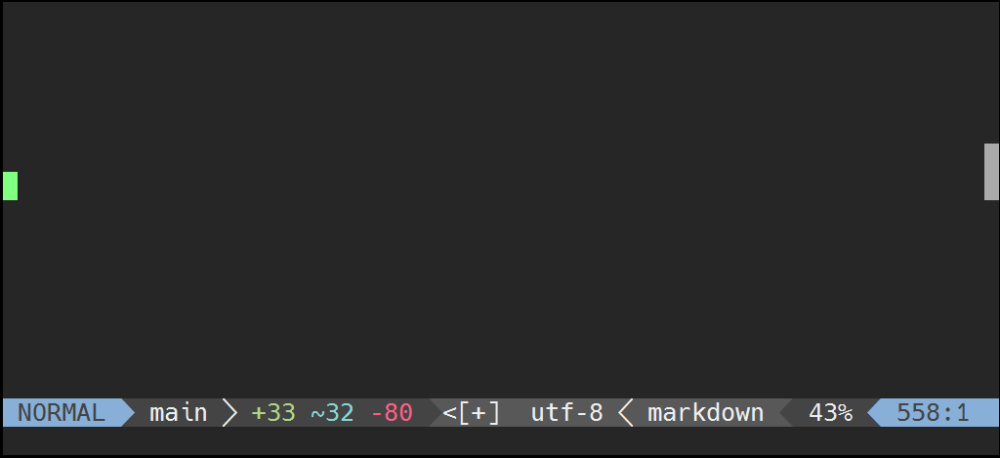
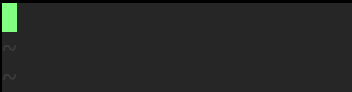

# extras

`luasnip.extras` 模块涵盖了可以轻松编写代码片段的节点。这里只是一个简短的大纲，其用法在 [`Examples/snippets.lua`] 中有更详细的说明。

[`Examples/snippets.lua`]: https://github.com/L3MON4D3/LuaSnip/blob/master/Examples/snippets.lua

* `lambda`：它只执行非常基本的字符串操作。例如，要将 n 次出现的所有 "a" 替换为 "e"，则使用
  `lambda(lambda._1:gsub("a"，"e"), n)`，签名类似于 FunctionNode。如果一个节点有多行，将使用 "\n" 进行拼接。

* `match`：可以根据谓词插入文本。节点的完整签名是 `match(argnodes, condition, then, else)`，其中
  * `argnodes` 可以在 FunctionNode 中指定
  * `condition` 可以是一个
    * string：解释为 Lua 模式。在 `\n` 拼接的文本中匹配第一个 argnode (`args[1]:match(condition)`)
    * function：形式为 `fn(args, snip) -> bool`，参数与 FunctionNode 相同，任何非 nil 或 false 的值都被解释为一个 match
    * lambda：`l._n` 是第 n 个 argnode 文本。如果必须在字符串匹配之前执行字符串操作，则这非常有用。
  * 如果条件匹配，则插入 `then`，如果条件不匹配，则插入 `else`。它们都可以是文本、lambda 或函数（具有上面指定的相同参数）。如果不传
    `then`，则 `then` 的值取决于 `condition`：
    * pattern：只返回 `match` 的返回值，例如如果有捕获组的话，则返回第一个捕获组。
    * function：函数的返回值，如果它是字符串或表；如果没有 `then`，则函数不能返回除字符串以外的表。
    * lambda：仅由 lambda 返回的第一个值。

    示例：
    * `match(n, "^ABC$", "A")` 如果第 n 个可跳转节点与 `ABC` 完全匹配，则插入 `A`，否则不插入 `A`。
    * `match(n, lambda._1:match(lambda._1:reverse()), "PALINDROME")` 如果第 n 个可跳转节点是回文 (palindrome)，则插入回文。
    * 以下代码将插入第一个 IntertNode，如果第二个 IntertNode 与第一个完全匹配，则所有出现的 `a` 都将替换为 `e`。
      ```lua
      s("extras3", {
        i(1), t { "", "" },
        i(2), t { "", "" },
        m({ 1, 2 }, l._1:match("^" .. l._2 .. "$"), l._1:gsub("a", "e"))
      }),
      ```

* `rep`：重复带有传递的索引的节点。`rep(1)` 表示重复第一个插入的内容。
* `partial`：直接插入函数的输出。对于 `partial(os.date, "%Y")` 这种来说很有用。
* `nonempty`：如果给定索引处的插入不包含任何文本，则插入文本。例如 `nonempty(n, "not empty!", "empty!")` 在 n 处为空时插入
  `empty`，非空时插入 `not empty!`。
* `dynamic_lambda`：操作与 `lambda` 几乎完全相同，只是还可以跳转，因此其内容很容易被覆盖。例如 
  `dynamic_lambda(2, lambda._1..lambda._1, 1)` 先把附加到其自身的节点 1 的内容包括进去，但第二次跳转将指向它，从而很容易覆盖生成的文本。只有当 argnode 更新文本时，才会更改文本。

```lua
ls.add_snippets("all", {
  s("extras1", {
    i(1), t { "", "" }, m(1, "^ABC$", "A")
  }),
  s("extras2", {
    i(1, "INPUT"), t { "", "" }, m(1, l._1:match(l._1:reverse()), "PALINDROME")
  }),
  s("extras3", {
    i(1), t { "", "" }, i(2), t { "", "" },
    m({ 1, 2 }, l._1:match("^" .. l._2 .. "$"), l._1:gsub("a", "e"))
  }),
  s("extras4", { i(1), t { "", "" }, extras.rep(1) }),
  s("extras5", { extras.partial(os.date, "%Y") }),
  s("extras6", { i(1, ""), t { "", "" }, extras.nonempty(1, "not empty!", "empty!") }),
  s("extras7", { i(1), t { "", "" }, extras.dynamic_lambda(2, l._1 .. l._1, 1) }),
})
```

extras1：

extras2：

extras3：

extras4：

extras5：

extras6：

extras7：

# FMT

可以使用 `require("luasnip.extras.fmt").fmt` 来创建更具可读性的代码片段。

简单的例子：

```lua
ls.add_snippets("all", {
  -- important! fmt does not return a snippet, it returns a table of nodes.
  s("example1", fmt("just an {iNode1}", {
    iNode1 = i(1, "example")
  })),
  s("example2", fmt([[
  if {} then
    {}
  end
  ]], {
    -- i(1) is at nodes[1], i(2) at nodes[2].
    i(1, "not now"), i(2, "when")
  })),
  s("example3", fmt([[
  if <> then
    <>
  end
  ]], {
    -- i(1) is at nodes[1], i(2) at nodes[2].
    i(1, "not now"), i(2, "when")
  }, {
    delimiters = "<>"
  })),
})
```


`fmt(format:string, nodes:table of nodes, opts:table|nil) -> table of nodes`：

| 参数     | 类型     | 含义                                                                                                                                |
|----------|----------|-------------------------------------------------------------------------------------------------------------------------------------|
| `format` | 字符串   | 使用 `{<somekey>}` 插值，其内容被替换成 `content[<somekey>]`[^format-key]，要转义 `{` 则使用 `{{`。不提供 key 则按数字顺序[^format] |
| `nodes`  | 节点表   | 比如 `{1, 2}` 表示使用前 2 个节点                                                                                                   |
| `opts`   | 可选参数 |                                                                                                                                     |
|          |          | `delimiters`：两字符的字符串，改变 `{}` 符号，比如使用 `<>`                                                                         |
|          |          | `strict`：是否警告未使用的节点，默认为 true                                                                                         |
|          |          | `trim_empty`：是否删除第一行和最后一行的空字符串 `%s`，默认为 true；对多行字符串 `[[]]` 很有用（更美观）                            |
|          |          | `dedent`：是否删除所有行的缩进，默认为 true；对多行字符串 `[[]]` 很有用（更美观）                                                   |


[^format-key]: 如果重复 key，第二次之后插入的内容是第一次插入内容的复制。

[^format]: `"{} ? {} : {}"` 变成 `"{1} ? {2} : {3}"`，`"{} ? {3} : {}"` 变成 `"{1} ? {3} : {4}"`。

`require "luasnip.extras.fmt".fmta` 与 `fmt` 的区别只是前者使用尖括号 `<>` 作为默认分隔符。

# On The Fly

你可以创建不会在所有文件中使用而只在单个会话中使用的片段。

这就像获取寄存器中的内容并将其转换为片段：使用以 `$` 为前缀的单词作为输入或副本（这取决于同一单词是否多次出现）。

你可以通过重复 `$` （即 `$$` ）来转义 `$`。

你的配置中还添加类似以下内容：

```vim
vnoremap <c-f>e "ec<cmd>lua require('luasnip.extras.otf').on_the_fly()<cr>
inoremap <c-f>e <cmd>lua require('luasnip.extras.otf').on_the_fly("e")<cr>
```

注意，你可以使用自己的映射来代替，也可以选择另一个寄存器。你甚至可以多次使用它，它就像是宏一样：

```vim
" For register a
vnoremap <c-f>a  "ac<cmd>lua require('luasnip.extras.otf').on_the_fly()<cr>
inoremap <c-f>a  <cmd>lua require('luasnip.extras.otf').on_the_fly("a")<cr>


" For register b
vnoremap <c-f>a  "bc<cmd>:lua require('luasnip.extras.otf').on_the_fly()<cr
inoremap <c-f>b  <cmd>lua require('luasnip.extras.otf').on_the_fly("b")<cr>
```


# select_choice

可以利用 `vim.ui.select` 直接选择选项，而不需要在选项之间循环。

只需要调用 `require("luasnip.extras.select_choice")`，最好是通过某个键绑定，例如

```vim
inoremap <c-s> <cmd>lua require("luasnip.extras.select_choice")()<cr>
```

这会对 `vim.ui.select` 的 `opts.kind` 提示设置为 `luasnip`。


# 文件类型函数

LuaSnip 包含一些可传递给 `ft_unc` 或 `load_ft_func` 的实用函数。

* `from_filetype`：`ft_func` 的默认值，只返回缓冲区的文件类型。
* `from_cursor_pos`：使用 treesitter 来确定光标处的文件类型。这样，就可以在注入区域中展开代码片断，只要 treesitter 
  解析器支持它们。如果与 `lazy_load` 结合使用，则必须特别注意，在给定缓冲区中可以展开的所有文件类型也由 `load_ft_func`
  返回（否则可能无法加载它们的片段）。这可以很容易地通过 `extend_load_ft` 来实现。
* `extend_load_ft`: `fn(extend_ft:map) -> fn`
  上述问题的一个简单解决方案是在 `lazy_load` 时加载比目标缓冲区更多的文件类型。这可以方便地通过的 `extend_load_ft` 
  来完成：使用一个表调用它，其中键是文件类型，值是额外加载的文件类型，并且返回一个可以传递给 `load_ft_func`
  的函数，并且正确地处理扩展文件类型。
  ```lua
  ls.config.setup {
    load_ft_func =
    -- Also load both lua and json when a markdown-file is opened,
    -- javascript for html.
    -- Other filetypes just load themselves.
    require "luasnip.extras.filetype_functions".extend_load_ft {
      markdown = { "lua", "json" },
      html = { "javascript" }
    }
  }
  ```

# LSP 片段

LuaSnip 可以使用 `ls.parser.parse_snippet(context, snippet_string)` 来解析 LSP 样式的片段：

```lua
ls.parser.parse_snippet({trig = "lsp"}, "$1 is ${2|hard,easy,challenging|}")
```


嵌套占位符 `... ${1:this is ${2:nested}} ...` 将转换为 ChoiceNode，并带有：
- 给定的代码片段 `this is ${1:nested}`和
- 一个空的插入节点


# 变量

支持所有 [`TM_something`] 变量，和两个新变量： `SELECT_RAW` 和 `SELECT_DEDENT`。

之所以引入这些代码，是因为 `TM_SELECTED_TEXT` 被设计为与 VScode 
行为兼容，当片段可以在除选择开始点之外的位置展开时（或对所选文本执行变换时），这可能是违反直觉的。

所有变量都可以在 LSP 解析的片段之外使用，因为它们的值存储在片段的 `snip.env` 表中：

```lua
s("selected_text", f(function(args, snip)
  local res, env = {}, snip.env
  table.insert(res, "Selected Text (current line is " .. env.TM_LINE_NUMBER .. "):")
  for _, ele in ipairs(env.SELECT_RAW) do table.insert(res, ele) end
  return res
end, {}))
```

要使用任何 `*SELECT*` 变量，必须通过 `require("luasnip").config.setup({store_selection_keys="<Tab>"})` 来设置
`store_selection_keys`，此时，在 visual 模式下按 `<Tab>` 将填充下一个片断的 `*SELECT*` 变量，然后清除它们。


[`TM_something`]: https://microsoft.github.io/language-server-protocol/specifications/lsp/3.17/specification/#snippet_syntax

# 环境变量命名空间

你也可以使用 `ls.env_namespace(name, opts)` 添加你自己的变量，其中：
* `name`:字符串,命名空间的名称，不能包含字符 `\_`
* `opts`：是包含以下内容的表（在下述情况下，`EnvVal` 都与 `string|list[string]` 一样：
  * `vars`：`(fn(name:string)->EnvVal) | map[string, EnvVal]`
    * 是一个函数，它接收字符串并返回该名称的变量的值
    * 或者是从变量名到值的表；此时，如果值是一个函数，它将在每个片段展开时惰性执行一次
  * `init`：`fn(pos: pair[int])->map[string, EnvVal]`
    获取从 0 开始的光标位置，并返回一个变量表，该表将在展开时设置为片段的环境，用于必须在该时刻计算的变量或彼此依赖的变量。
  * `eager`：`list[string]`，将从 `vars` 获取并急于追加的变量的名称，比如 `init` 中的变量
  * `multiline_vars`：`(fn(name:string)->bool)|map[sting, bool]|bool|string[]`
     如果某些变量是表或字符串，则可以是获取变量名称的函数，如果变量是键，则返回 true 
     作为表的变量列表，或者是完整命名空间的布尔值，默认为 false。这个字段是可选的，但你需要提供
     `init` 或 `vars`，并且 `eager` 不能没有 `vars`。此外，你不能覆盖默认变量的名称空间。

举一个简单的例子，让我们更清楚地了解：

```lua
local function random_lang()
  return ({ "LUA", "VIML", "VIML9" })[math.floor(math.random() / 2 + 1.5)]
end

ls.env_namespace("MY", { vars = { NAME = "LuaSnip", LANG = random_lang } })

-- then you can use  $MY_NAME and $MY_LANG in your snippets

ls.env_namespace("SYS", { vars = os.getenv, eager = { "HOME" } })

-- then you can use  $SYS_HOME which was eagerly initialized but also $SYS_USER (or any other system environment var) in your snippets

ls.env_namespace("POS", { init = function(pos) return { VAL = vim.inspect(pos) } end })

-- then you can use  $POS_VAL in your snippets

s("custom_env", d(1, function(args, parent)
  local env = parent.snippet.env
  return sn(nil, t {
    "NAME: " .. env.MY_NAME,
    "LANG: " .. env.MY_LANG,
    "HOME: " .. env.SYS_HOME,
    "USER: " .. env.SYS_USER,
    "VAL: " .. env.POS_VAL
  })
end, {}))
```


# Loaders

LuaSnip 能够加载不同格式的代码片段，包括成熟的 Vscode 和 Snipmate 格式，以及用 Lua 编写片段的纯 Lua 文件。

所有加载器都共享一个类似的接口：

```lua
require("luasnip.loaders.from_{vscode,snipmate,lua}").{lazy_,}load(opts:table|nil)
```

其中 `opts` 可以包含以下 key：

| key                           | 类型                     | 默认值                | 说明                                                                |
|-------------------------------|--------------------------|-----------------------|---------------------------------------------------------------------|
| `paths`                       | 表或一个逗号分割的字符串 | `runtimepath`[^paths] | 可以使用 `~/`（相对于 `$HOME`）或 `./`（相对于$MYVIMRC）            |
| `exclude`                     | 表                       | `{}`                  | 排除的语言列表                                                      |
| `include`                     | 表                       | 所有语言              | 包含的语言列表                                                      |
| `{override,default}_priority` |                          |                       | 直接传给 [`add_snippets`]，从而改变某组加载片段的优先级（可搭配 `{in,ex}clude` 来缩小片段范围） |

[^paths]: 每种 loader 的具体路径略有不同：
- `lua`：片段必须处于 `luasnippets` 目录中
- `snipmate`：片段必须处于 `snippets` 目录中
- `vscode`：`runtimepath` 下任何具有 `package.json` 的目录

`load` 会立即加载片段，但 `lazy_load` 会推迟加载到实际需要的片段：无论何时创建新的缓冲区，或者更改文件类型，LuaSnip 
实际上都会加载与该缓冲区相关联的文件类型的 `lazy_load` 片段。可以通过在 `setup` 中自定义 `load_ft_func`
来改变这种关联：该选项接受一个函数 `fn(bufnr) -> filetypes (string[])`，该函数传入一个 `bufnr`，返回应该加载的文件类型。

所有的 loader 都支持重新加载，所以简单地编辑任何文件贡献的片段都会重新加载它的片段：只有在编辑文件的会话中才会这么做，因为使用
`BufWritePost` 来重载，而不是一些较低级别的机制。

为了方便地编辑这些文件，Luasnip 提供了一个基于 [`vim.ui.select`] 的对话框，在该对话框中，先选文件类型，然后选文件。

[`add_snippets`]: #api-reference

[`vim.ui.select`]: #edit_snippets

## 故障排除

* LuaSnip 使用 `all` 作为全局文件类型。有时其他的代码片段合辑提供另一个叫法的全局文件类型，如 [`honza/vim-snippets`] 使用 `_`
  表示全局文件类型。此时，扩展文件类型：

  ```lua
  ls.filetype_extend("all", { "_" })
  ```

  所以通常，如果在加载合辑时某些片段没有出现，那么第一步就是检查 LuaSnip 实际正在查找的文件类型
  `:lua print(vim.inspect(require("luasnip").get_snippet_filetypes()))`，将它们打印到当前缓冲区，而不是在合辑中为缺失的片段提供的文件类型。
  如果确实存在不匹配，就可以使用 `filetype_extend` 来添加合辑的文件类型：

  ```lua
  ls.filetype_extend("<luasnip-filetype>", { "<collection-filetype>" })
  ```

* 由于我们只在某些事件上 `lazy_load` 片段，当使用非默认的 `ft_func` 时，`lazy_load`
  可能不会很好地发挥作用：比如如果片段依赖于游标位置，那么当 `lazy_load`
  事件被触发时，只会加载游标位置的文件类型。查看 [`extend_load_ft`] 来了解解决方案。

[`extend_load_ft`]: #filetype_functions

## Vscode

[`friendly-snippets`]: https://github.com/rafamadriz/friendly-snippets

有关这些代码片断库结构的参考，请参考 [`Friendly-Snippets`]。

LuaSnip 支持一个小扩展：片段可以在 `luasnip` 表中包含特定于 LuaSnip 的选项：

```json
"example1": {
	"prefix": "options",
	"body": [
		"whoa! :O"
	],
	"luasnip": {
		"priority": 2000,
		"autotrigger": true
	}
}
```
示例：

`~/.config/nvim/my_snippets/package.json`：

```json
{
	"name": "example-snippets",
	"contributes": {
		"snippets": [
			{
				"language": [
					"all"
				],
				"path": "./snippets/all.json"
			},
			{
				"language": [
					"lua"
				],
				"path": "./lua.json"
			}
		]
	}
}
```

`~/.config/nvim/my_snippets/snippets/all.json`:

```json
{
	"snip1": {
		"prefix": "all1",
		"body": [
			"expands? jumps? $1 $2 !"
		]
	},
	"snip2": {
		"prefix": "all2",
		"body": [
			"multi $1",
			"line $2",
			"snippet$0"
		]
	},
}
```

`~/.config/nvim/my_snippets/lua.json`:

```json
{
	"snip1": {
		"prefix": "lua",
		"body": [
			"lualualua"
		]
	}
}
```

此片段合辑可以从以下任一项加载：

```lua
-- don't pass any arguments, luasnip will find the collection because it is
-- (probably) in rtp.
require("luasnip.loaders.from_vscode").lazy_load()
-- specify the full path...
require("luasnip.loaders.from_vscode").lazy_load({paths = "~/.config/nvim/my_snippets"})
-- or relative to the directory of $MYVIMRC
require("luasnip.loaders.from_vscode").load({paths = "./my_snippets"})
```

## SnipMate

[`honza/vim-snippets`]: https://github.com/honza/vim-snippets

Luasnip 不支持完整的 SnipMate 格式，只加载 `./{ft}.snippets` 和 `./{ft}/*.snippets`。

有关许多示例，请参考 [`honza/vim-snippets`]。

与 Vscode 一样，LuaSnip 也对 SnipMate 格式进行了扩展，来提供更高级的功能：

```snippets
priority 2000
autosnippet options
	whoa :O
```

示例：

`~/.config/nvim/snippets/c.snippets`:

```snippets
# this is a comment
snippet c c-snippet
	c!
```

`~/.config/nvim/snippets/cpp.snippets`:

```snippets
extends c

snippet cpp cpp-snippet
	cpp!
```

同样，可以从以下任何一项加载上述片段：

```lua
require("luasnip.loaders.from_snipmate").load()
-- specify the full path...
require("luasnip.loaders.from_snipmate").lazy_load({paths = "~/.config/nvim/snippets"})
-- or relative to the directory of $MYVIMRC
require("luasnip.loaders.from_snipmate").lazy_load({paths = "./snippets"})
```

需要注意的事项：

* 同时在 `<ft1>.snippets` 中使用 `extends <ft2>` 和 `ls.filetype_extend("<ft1>", {"<ft2>"})` 会导致片段重复
* `${VISUAL}` 将被替换为 `$TM_SELECTED_TEXT`，以便与 LuaSnip 统一
* 未实现用 \` 反引号计算值。这或许在以后会被实现。

## Lua

除了通过 `addsnippets` 来添加片段之外，还可以将它们存储在单独的文件中并加载所有这些文件。

这里的文件结构类似于 SnipMate 结构，例如使用 `<ft>.lua` 或 `<ft>/*.lua` 来为文件类型 `<ft>` 
添加片断。这些文件需要返回两个代码片断列表（两个列表中的任何一个都可以是 `nil`）：
- 第一个片段是 `<ft>` 的常规片段
- 第二个片段是自动片段：如果使用此表，请确保在 `setup` 或 `set_config` 中启用它们

[`luasnip.config.snip_env`]: https://github.com/L3MON4D3/LuaSnip/blob/69cb81cf7490666890545fef905d31a414edc15b/lua/luasnip/config.lua#L82-L104

在每个文件中定义所有片段构造函数 (`s`、`c`、`t`，...) 相当繁琐，所以 LuaSnip 会将一些全局变量带入执行这些文件的范围。

默认情况下，将使用 [`luasnip.config.snip_env`] 中的名称，但你也可以在 `setup` 中设置 `snip_env` 来自定义名称。

示例：

`~/snippets/all.lua`:

```lua
return {
	parse("trig", "loaded!!")
}
```

`~/snippets/c.lua`:

```lua
return {
	parse("ctrig", "also loaded!!")
}, {
	parse("autotrig", "autotriggered, if enabled")
}
```

加载方式：

```lua
require("luasnip.loaders.from_lua").load({paths = "~/snippets"})
```

## 编辑片段

为了方便地编辑当前会话的片断，任何 loader 加载的文件都可以通过
`require("luasnip.loaders").edit_snippet_files(opts:table|nil)` 快速编辑，它将打开一个 `vim.ui.select`
对话框，先选择一个文件类型，然后如果有多个关联文件就选择要编辑的关联文件。



`opts` 如下设置：

* `format`：`fn(file:string, source_name:string) -> string|nil`。其中 `file` 是文件的路径，`source_name` 是
  `"lua"`、 `"snipmate"`、 `"vscode"` 中的一个。 如果返回一个字符串，则将其用作项目的标题；如果返回 `nil`
  就过滤掉该项目。该选项的默认设置是将 `file` 中的一些长字符串（packer 路径和 config 路径）替换为较短的符号名称（`"$plugins"`、
  `"$CONFIG"`），但可以将其扩展为：
  *  过滤某些特定来源路径中的文件
  *  使用符号名称更积极地缩短路径，例如 `"$FRIENDLY_SNIPPETS"`

  例子：隐藏 lua 来源的文件（即隐藏 `*.lua` 文件），并把路径缩短成 `$LuaSnip` 显示出来：
  ```lua
  require "luasnip.loaders" .edit_snippet_files {
    format = function(file, source_name)
      if source_name == "lua" then return nil
      else return file:gsub("/root/.config/nvim/luasnippets", "$LuaSnip")
      end
    end
  }
  ```
  
* `edit`: `fn(file:string)`。此函数表示打开文件进行编辑。默认值是一个简单的 `vim.cmd("edit " .. file)`
  （直接换成当前缓冲区），但你可以拆分、在标签或浮动窗口中打开文件，例如
  `require("luasnip.loaders").edit_snippet_files { edit = function(file) vim.cmd("vs|e " .. file) end }`。

调用此函数的一种舒适方法是将其注册成命令：

```vim
command! LuaSnipEdit :lua require("luasnip.loaders").edit_snippet_files()
```

# SnippetProxy

`SnippetProxy` 在 LuaSnip 内部使用，以减少从 SnipMate 库或 Vscode 包加载代码片段的前期成本。

这通过在展开时才解析片段来实现的，而不是在从某个文件中读取片段之后立即进行解析。

`SnippetProxy` 也可以直接从 Lua 中使用，获得相同的好处：

这将在启动时解析片段：

```lua
ls.parser.parse_snippet("trig", "a snippet $1!")
```

这将在展开时解析代码片段：

```lua
local sp = require("luasnip.nodes.snippetProxy")
sp("trig", "a snippet $1")
```

# Ext_Opts

`ext_opts` 可以设置用于标记节点位置的 extmark 的 `opts`（参考
`nvim_buf_set_extmark`），可以是全局的，也可以是按片段的，也可以是按节点的。

这意味着它们可高亮显示节点内的文本，或将虚拟文本添加到节点开始的行上。

下面是设置单节点 `ext_opts` 的 `node_ext_opts` 示例：

```lua
local ext_opts = {
  -- these ext_opts are applied when the node is active (e.g. it has been
  -- jumped into, and not out yet).
  active =
  -- this is the table actually passed to `nvim_buf_set_extmark`.
  {
    -- highlight the text inside the node red.
    hl_group = "Error"
  },
  -- these ext_opts are applied when the node is not active, but
  -- the snippet still is.
  passive = {
    -- add virtual text on the line of the node, behind all text.
    virt_text = { { "virtual text!!", "WarningMsg" } }
  },
  -- and these are applied when both the node and the snippet are inactive.
  snippet_passive = {}
}

ls.add_snippets("all", {
  s("ext_opt", {
    i(1, "text1", {
      node_ext_opts = ext_opts
    }),
    t { "", "" },
    i(2, "text2", {
      node_ext_opts = ext_opts
    })
  }),
})
```



在上面的例子中，InsertNode 内的文本以红色高亮显示，而虚拟文本 `virtual text!!` 只要片段处于活动状态，就可见。

需要特别注意的是，`snippet_passive` 适用于 `snippet_passive`、 `passive` 和 `active` 状态，
`passive` 适用于 `passive` 和 `active` 状态， `active`仅适用于 `active` 状态。

若要禁用处于较低状态的 key，则必须将其显式设置为默认值，例如当节点为 `active` 时，若要禁用从 
`passive` 继承的高亮显示，则可以在 `active` 中将 `hl_group` 设置为 `None`。

---

如前所述，这些`ext_opts`也可以全局应用，也可以应用于整个片段。为此，需要指定应将给定的`ext_opts`集应用于哪种节点：

```lua
local types = require("luasnip.util.types")

ls.config.setup({
	ext_opts = {
		[types.insertNode] = {
			active = {...},
			passive = {...},
			snippet_passive = {...}
		},
		[types.choiceNode] = {
			active = {...}
		},
		[types.snippet] = {
			passive = {...}
		}
	}
})
```

以上代码将给定的 `ext_opts` 应用于所有片断中这些类型的所有节点。

```lua
local types = require("luasnip.util.types")

s("trig", { i(1, "text1"), i(2, "text2") }, {
	child_ext_opts = {
		[types.insertNode] = {
			passive = {
				hl_group = "GruvboxAqua"
			}
		}
	}
})
```

而这里的 `ext_opts` 只应用于该片断中的 IntertNodes。

---

默认情况下，节点实际使用的 `ext_opts` （即 `node_ext_opts`）是父节点的 `effective_child_ext_opts[node.type]`，而父节点的
`child_ext_opts` 又是通过配置中的全局 `ext_opts` 设置的。

可以向片段或节点 opts 传递 `merge_node/child_ext_opts=false` 来阻止这两个合并：

```lua
ls.config.setup({
	ext_opts = {
		[types.insertNode] = {
			active = {...}
		}
	}
})

...

s("trig", {
	i(1, "text1", {
		node_ext_opts = {
			active = {...}
		},
		merge_node_ext_opts = false
	}), i(2, "text2") }, {
	child_ext_opts = {
		[types.insertNode] = {
			passive = {...}
		}
	},
	merge_child_ext_opts = false
})
```

---

也可以通过标准的 Highlight-Groups 设置全局 `ext_opts` 的 `hl_group`：

```lua
vim.cmd("hi link LuasnipInsertNodePassive GruvboxRed")
vim.cmd("hi link LuasnipSnippetPassive GruvboxBlue")

-- needs to be called for resolving the actual ext_opts.
ls.config.setup({})
```

所使用的高亮显示组的名称是 `Luasnip<node>{Passive,Active,SnippetPassive}`，其中
`node` 是任何节点或片段类型名称，且使用 PascalCase 写法。

---

高亮显示嵌套节点时可能出现的一个问题是，节点的高亮应在其内部嵌套的节点之上显示。

这可以通过 `ext_opts` 中的 `priority` key 来控制。

通常，该值是一个正值，在这里它是相对于某个基本优先级的，每个片段嵌套级别增加，该值都会增加。

初始基本优先级及其增加的步长可使用 `ext_base_prio` 和 `ext_prio_increase` 进行控制：

```lua
ls.config.setup({
	ext_opts = {
		[types.insertNode] = {
			active = {
				hl_group = "GruvboxBlue",
				-- the priorities should be \in [0, ext_prio_increase).
				priority = 1
			}
		},
		[types.choiceNode] = {
			active = {
				hl_group = "GruvboxRed"
				-- priority defaults to 0
			}
		}
	}
	ext_base_prio = 200,
	ext_prio_increase = 2
})
```

这里，嵌套在 ChoiceNode 中的 IntertNode 的高亮始终在 ChoiceNode 之上显示。

# DocString

可使用 `snippet:get_docstring()` 查询文档字符串。

此函数对片段进行求值，就像它正常展开一样，如果片段中的 DynamicNode 依赖于参数节点以外的输入，这可能会有问题。

`snip.env` 和 `snip.captures` 分别表示被查询变量的名称和捕获的索引：
* `snip.env.TM_SELECTED_TEXT` -> `$TM_SELECTED_TEXT`
* `snip.captures[1]` -> `$CAPTURES1`

尽管以下片段会产生更具描述性的文档字符串，但它可能在依赖于捕获为数字的函数中导致错误：

```lua
s({trig = "(%d)", regTrig = true}, {
	f(function(args, snip)
		return string.rep("repeatme ", tonumber(snip.captures[1]))
	end, {})
}),
```

这段代码运行良好，因为 `snippet.captures[1]` 始终是一个数字。但是，在文档字符串生成过程中，
`snippet.captures[1]` 为 `$CAPTURES1`，这将导致在函数节点中出现错误。

定义片断时指定 `docTrig`，可防止 `snippet.captures` 出现问题：

```lua
s({trig = "(%d)", regTrig = true, docTrig = "3"}, {
	f(function(args, snip)
		return string.rep("repeatme ", tonumber(snip.captures[1]))
	end, {})
}),
```

`snippet.captures` 和 `snippet.trigger` 会被填充数据，如同实际使用 `3` 触发一样。

其他问题必须手动处理，方法是检查 `snip.env` 的内容或预定义片段的文档字符串：

```lua
s({trig = "(%d)", regTrig = true, docstring = "repeatmerepeatmerepeatme"}, {
	f(function(args, snip)
		return string.rep("repeatme ", tonumber(snip.captures[1]))
	end, {})
}),
```

---

以一个完整的例子说明 `docTrig` 和 `docstring` 的具体作用，考虑下面三个片段和两个场景：

```lua
local doc1 = s({ trig = "doc(%d)", regTrig = true, }, f(
  function(_args, snip)
    return string.rep("repeatme ", tonumber(snip.captures[1]))
  end, {}
))
local doc2 = s({ trig = "doc(%d)", regTrig = true, docTrig = "doc2" }, f(
  function(_args, snip)
    return string.rep("repeatme ", tonumber(snip.captures[1]))
  end, {}
))
local doc3 = s({ trig = "doc(%d)", regTrig = true, docstring = "repeatmerepeatmerepeatme" }, f(
  function(_args, snip)
    return string.rep("repeatme ", tonumber(snip.captures[1]))
  end, {}
))
```

场景一：当放入 `ls.add_snippets("all", { doc1, doc2, doc3 })`，或者等价地，放入 `all.lua` 的返回值：

```lua
return { doc1, doc2, doc3 }
```

都能输入 `doc2` 后顺利展开成 `repeatme repeatme `。

场景二：生成文档字符串

```lua
local function gen(snip)
  return table.concat(snip:get_docstring())
end

return {
  parse("doc_two", gen(doc2)),   -- 直接生成 `repeatme repeatme `
  parse("doc_three", gen(doc3)), -- 直接生成 `repeatmerepeatmerepeatme`
  doc1, -- doc2 和 doc3 在这行与情况一是一样的：按照输入的数字展开
}
```


# DocString-Cache

尽管生成文档字符串的速度很快，但只要片段没有更改，最好不要重做。

使用 `ls.store_snippet_docstrings(snippets)` 及其对应的 `ls.load_snippet_docstrings(snippets)`
可将它们从片断中序列化或反序列化到片断。这两个函数都接受如下结构的表： 
`{ft1={snippets}，ft2={snippets}}`。这样一个包含所有片段的表可通过 `ls.get_snippets()` 得到。

应该在所有 `loader` 函数之前调用 `load`，因为来自 Vscode 的片段已经设置好了自己的文档字符串。尽管 docstring
不会被覆盖，但不这么做的话会导致不必要的调用。

缓存位于 `stdpath("cache")/luasnip/docstrings.json`，很可能是 `~/.cache/nvim/luasnip/docstrings.json`。

# Event

Event 可用于对片段中的某些操作做出反应。这些回调可以按片断定义（片断构造函数中的 `callbacks` key），也可以全局定义（自动命令）。

* `callbacks`：`fn(node[, event_args]) -> event_res`。所有回调函数获得相关事件的节点和可选参数 `event_args`。
  * `event_res`：只用于 `pre_expand` 事件，片段中某些属性可被改变。
* `autocommand`： LuaSnip 使用 `User` 事件，可以使用以下方式注册自动命令：

```vim
au User SomeUserEvent echom "SomeUserEvent was triggered"
```

或

```lua
vim.api.nvim_create_autocommand("User", {
	patter = "SomeUserEvent",
	command = "echom SomeUserEvent was triggered"
})
```

节点和 `event_args` 可通过 `require("luasnip").session` 访问：

* `node`: `session.event_node`
* `event_args`: `session.event_args`

**Events**:

| event           | `User-event`                             | `event_args`                    | 描述                                     |
|-----------------|------------------------------------------|---------------------------------|------------------------------------------|
| `enter/leave`   | `Luasnip<Node>{Enter,Leave}`[^Node-case] | 无                              | 进入或离开节点时调用，比如在片断中跳跃时 |
| `change_choice` | `LuasnipChangeChoice`                    | 无                              | ChoiceNode 中改变选择时                  |
| `pre_expand`    | `LuasnipPreExpand`                       | 见[^event_args]|片段展开前调用。允许修改文本。<br>展开的位置会调整，因此片段在已有的文本的位置上展开 |

[^Node-case]: `Node` 使用 PascalCase，如`InsertNode`、 `DynamicNode`

[^event_args]: `pre_expand` 的 `event_args` 有三种：
* `expand_pos`：`{<row>, <column>}`，片段的展开位置，两个都从 0 开始。
* `event_res`
* `env_override`：`map string->(string[]"string)` 覆盖或添加片段环境 `snip.env`


一个没什么用的用例如下，它在进入节点文本后打印内容：

```lua
vim.api.nvim_create_autocmd("User", {
	pattern = "LuasnipInsertNodeEnter",
	callback = function()
		local node = require("luasnip").session.event_node
		print(table.concat(node:get_text(), "\n"))
	end
})
```

或有关展开的一些信息：

```lua
vim.api.nvim_create_autocmd("User", {
	pattern = "LuasnipPreExpand",
	callback = function()
		-- get event-parameters from `session`.
		local snippet = require("luasnip").session.event_node
		local expand_position =
			require("luasnip").session.event_args.expand_pos

		print(string.format("expanding snippet %s at %s:%s",
			table.concat(snippet:get_docstring(), "\n"),
			expand_position[1],
			expand_position[2]
		))
	end
})
```

结合以上两个事件和下面的片段：

```lua
ls.add_snippets("all", {
  s("ternary", {
    -- equivalent to "${1:cond} ? ${2:then} : ${3:else}"
    i(1, "cond"), t(" ? "), i(2, "then"), t(" : "), i(3, "else")
  })
}
```

跳转至最后，打印的内容：

```text
expanding snippet ${1:cond} ? ${2:then} : ${3:else}$0 at 0:0
cond
then
else
```

# 清理

函数 `ls.cleanup()` 触发 `LuasnipCleanup` user-event，从而你能对自己的片段进行某种清理，默认情况下会清空片断表和 lazy_Load 的缓存。

