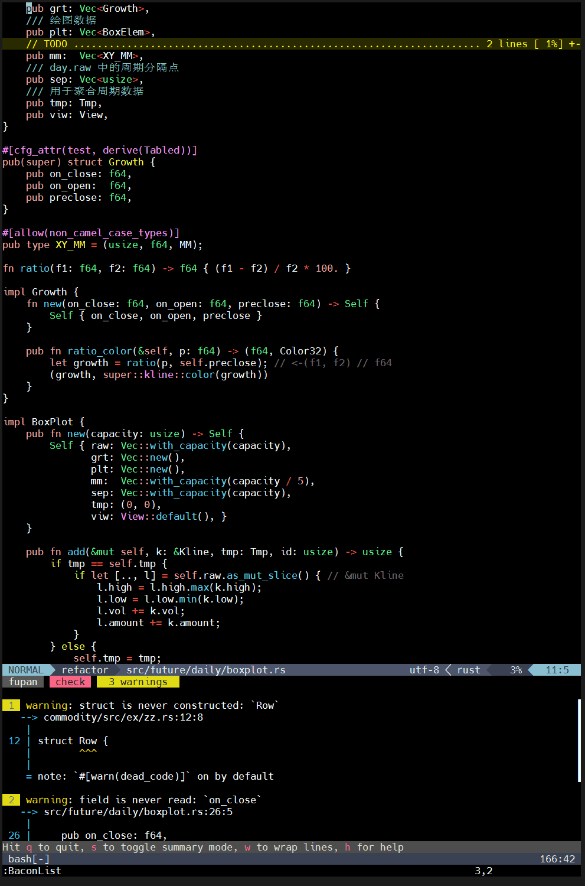
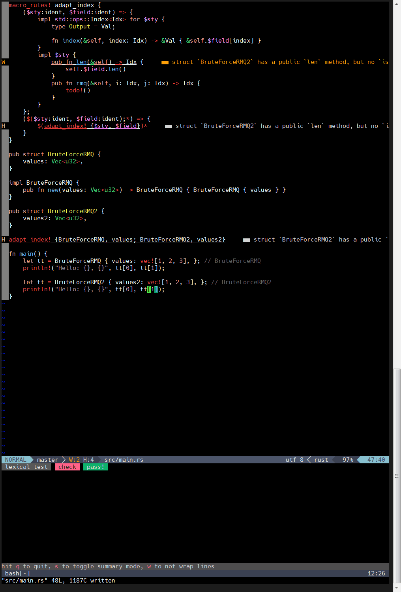

# bacon

背景：搭配 RA lsp 的 nvim 固然在单个 **被打开的** 文件中能很好的工作，但有时候 RA 不能正常工作。

比如有时候 RA 会无法马上显示当前文件的错误，即便这个文件是小型代码，有时候需要重启，甚至关闭再重启才能正常工作。

而且，只使用 RA 是无法在项目级别的错误、警告等地方告知你，更别说跳转了。

也就是说，如果你不打开一个 rs 文件，你永远无法从 RA 知道这个文件需不需要修复代码。

当然，正常情况下，我们使用 `cargo check` 或者 `cargo build` 等命令，可以从 cargo 给的信息中知道所有代码 —— 包括其依赖 —— 是否有问题。

可每次手动运行命令是很重复而无聊的事情。

而 [bacon] 可以帮你从这种境况中解脱出来，它是一个基于 `cargo` 命令的监视工具，当它每次监测到项目文件被改动时（比如保存），自动运行 job。

[bacon]: https://github.com/Canop/bacon

比如默认的 `check-all` job 为：

```toml
[jobs.check-all]
command = ["cargo", "check", "--all-targets", "--color", "always"]
need_stdout = false
watch = ["tests", "benches", "examples"]
```

这意味着当你使用 `bacon check-all` 命令时，它会对 `src` 目录，以及 `tests` 等目录的项目文件进行监测，如果被改动，**自动** 运行 `cargo check --all-targets` 命令[^all-targets]。

[^all-targets]: 即 `cargo check --lib --bins --tests --benches --examples`。

你可以订制 job：把你常用的运行命令和监视目录放到项目根目录的 `bacon.toml` 中即可。


作为一个通用的命令行工具，这种模式的监视工具或许有很多，但它的亮点在于完全考虑 cargo 
命令，对 cargo 的信息输出做了二次封装，从而提供更人性化的功能：
* 永远保持统计信息到第一行：这意味着调整终端大小和缩放之后会重新绘制所有内容自适应
* 折叠切换：当你只需要概览时，可按 `s` 只显示每条信息的原因和源码位置
* 换行切换：有很多长文本内容时，可按 `w` 不换行
* 源码跳转：见该作者写的配套的 [nvim-bacon](https://github.com/Canop/nvim-bacon) 
  插件。你可以跳转到任何出现问题的地方（只要 cargo 提供了），比如跨 lib/bin/test/example、跨 crate。


在 Vim 的“旧时代”，你可以使用 `:!cargo check | copen` 命令来打开 quickfix
窗口，逐一修复和跳转下一个错误。

但我更倾向于使用 `:BaconList` 打开 popup window 来进行临时性的操作（或者 `:BaconNext` `:BaconPrevious` 直接跳转），而把常驻的终端窗口放置在一旁（因为 bacon 需要终端）。比如：


请单击右键“新标签页打开图片”来查看动图（注意：录制时为竖屏，所以这个图很长）。

